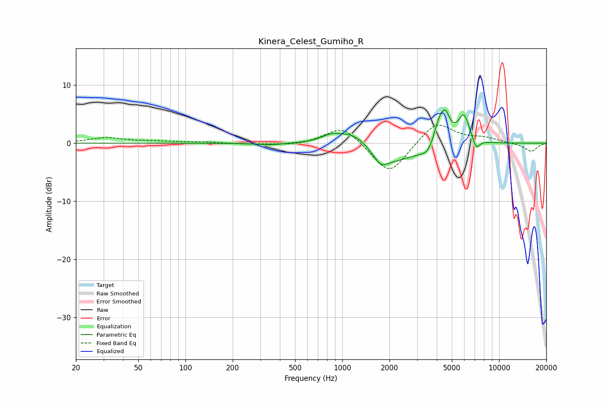

# Kinera_Celest_Gumiho_R
See [usage instructions](https://github.com/jaakkopasanen/AutoEq#usage) for more options and info.

### Parametric EQs
Apply preamp of -5.8 dB when using parametric equalizer.

|   # | Type    |   Fc (Hz) |    Q |   Gain (dB) |
|-----|---------|-----------|------|-------------|
|   1 | Peaking |       346 | 1.76 |        -0.3 |
|   2 | Peaking |       838 | 2.51 |         0.8 |
|   3 | Peaking |      1191 | 1.16 |         3.5 |
|   4 | Peaking |      1762 | 3.52 |        -1.6 |
|   5 | Peaking |      1920 | 0.79 |        -4   |
|   6 | Peaking |      3655 | 2.59 |        -3.3 |
|   7 | Peaking |      4146 | 2.78 |         6.3 |
|   8 | Peaking |      4566 | 5.36 |         2.5 |
|   9 | Peaking |      5961 | 3.74 |         4.7 |
|  10 | Peaking |      7149 | 5.98 |        -1.9 |

### Fixed Band EQs
When using fixed band (also called graphic) equalizer, apply preamp of **-3.2 dB** (if available) and set gains manually with these parameters.

|   # | Type    |   Fc (Hz) |    Q |   Gain (dB) |
|-----|---------|-----------|------|-------------|
|   1 | Peaking |        31 | 1.41 |         0.9 |
|   2 | Peaking |        62 | 1.41 |         0.3 |
|   3 | Peaking |       125 | 1.41 |         0.2 |
|   4 | Peaking |       250 | 1.41 |        -0.2 |
|   5 | Peaking |       500 | 1.41 |        -0.4 |
|   6 | Peaking |      1000 | 1.41 |         3.2 |
|   7 | Peaking |      2000 | 1.41 |        -5.6 |
|   8 | Peaking |      4000 | 1.41 |         3.8 |
|   9 | Peaking |      8000 | 1.41 |         0.8 |
|  10 | Peaking |     16000 | 1.41 |        -1.4 |

### Graphs

