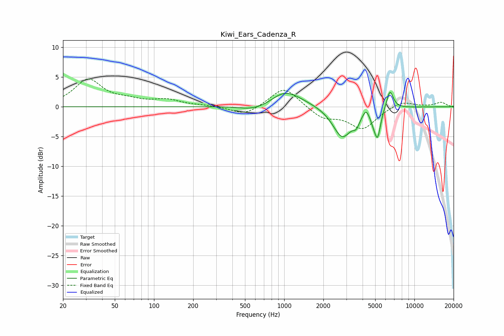

# Kiwi_Ears_Cadenza_R
See [usage instructions](https://github.com/jaakkopasanen/AutoEq#usage) for more options and info.

### Parametric EQs
Apply preamp of -2.5 dB when using parametric equalizer.

|   # | Type    |   Fc (Hz) |    Q |   Gain (dB) |
|-----|---------|-----------|------|-------------|
|   1 | Peaking |       535 | 1.68 |        -0.4 |
|   2 | Peaking |       701 | 1.17 |        -0.9 |
|   3 | Peaking |       999 | 1.27 |         2.3 |
|   4 | Peaking |      1170 | 0.83 |         0.7 |
|   5 | Peaking |      2792 | 1.93 |        -5.2 |
|   6 | Peaking |      3573 | 5.6  |        -1.4 |
|   7 | Peaking |      4244 | 6    |         1.3 |
|   8 | Peaking |      4841 | 6    |        -1.2 |
|   9 | Peaking |      5216 | 5.98 |        -4.5 |
|  10 | Peaking |      6485 | 5.2  |         3.2 |

### Fixed Band EQs
When using fixed band (also called graphic) equalizer, apply preamp of **-4.8 dB** (if available) and set gains manually with these parameters.

|   # | Type    |   Fc (Hz) |    Q |   Gain (dB) |
|-----|---------|-----------|------|-------------|
|   1 | Peaking |        31 | 1.41 |         4.5 |
|   2 | Peaking |        62 | 1.41 |         0.8 |
|   3 | Peaking |       125 | 1.41 |         1.1 |
|   4 | Peaking |       250 | 1.41 |         0.2 |
|   5 | Peaking |       500 | 1.41 |        -1.5 |
|   6 | Peaking |      1000 | 1.41 |         3.5 |
|   7 | Peaking |      2000 | 1.41 |        -1.9 |
|   8 | Peaking |      4000 | 1.41 |        -3.6 |
|   9 | Peaking |      8000 | 1.41 |         1.1 |
|  10 | Peaking |     16000 | 1.41 |         0.7 |

### Graphs

