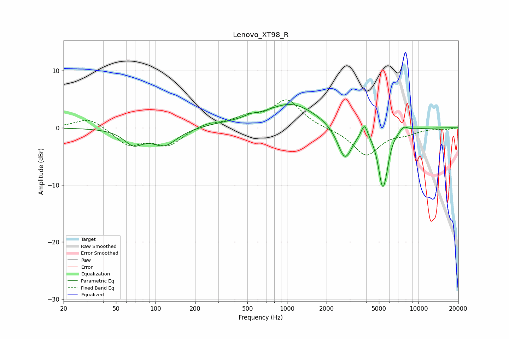

# Lenovo_XT98_R
See [usage instructions](https://github.com/jaakkopasanen/AutoEq#usage) for more options and info.

### Parametric EQs
Apply preamp of -4.2 dB when using parametric equalizer.

|   # | Type    |   Fc (Hz) |    Q |   Gain (dB) |
|-----|---------|-----------|------|-------------|
|   1 | Peaking |        68 | 1.99 |        -2.5 |
|   2 | Peaking |       117 | 1.53 |        -2.9 |
|   3 | Peaking |       320 | 0.93 |         0.5 |
|   4 | Peaking |       527 | 2.75 |         0.5 |
|   5 | Peaking |      1078 | 0.72 |         4.2 |
|   6 | Peaking |      2756 | 2.5  |        -6   |
|   7 | Peaking |      3879 | 5.99 |         2.3 |
|   8 | Peaking |      5330 | 3.97 |        -9.6 |
|   9 | Peaking |      5701 | 6    |        -1.5 |
|  10 | Peaking |      7710 | 4.24 |         0.9 |

### Fixed Band EQs
When using fixed band (also called graphic) equalizer, apply preamp of **-5.0 dB** (if available) and set gains manually with these parameters.

|   # | Type    |   Fc (Hz) |    Q |   Gain (dB) |
|-----|---------|-----------|------|-------------|
|   1 | Peaking |        31 | 1.41 |         1.9 |
|   2 | Peaking |        62 | 1.41 |        -2.9 |
|   3 | Peaking |       125 | 1.41 |        -2.9 |
|   4 | Peaking |       250 | 1.41 |         0.8 |
|   5 | Peaking |       500 | 1.41 |         1.6 |
|   6 | Peaking |      1000 | 1.41 |         4.8 |
|   7 | Peaking |      2000 | 1.41 |        -0.1 |
|   8 | Peaking |      4000 | 1.41 |        -4.8 |
|   9 | Peaking |      8000 | 1.41 |        -0.8 |
|  10 | Peaking |     16000 | 1.41 |        -0.3 |

### Graphs

