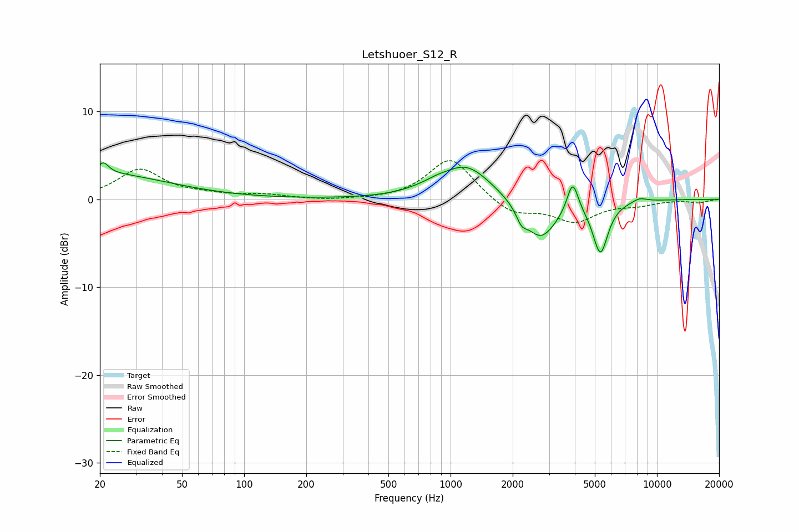

# Letshuoer_S12_R
See [usage instructions](https://github.com/jaakkopasanen/AutoEq#usage) for more options and info.

### Parametric EQs
Apply preamp of -4.2 dB when using parametric equalizer.

|   # | Type    |   Fc (Hz) |    Q |   Gain (dB) |
|-----|---------|-----------|------|-------------|
|   1 | Peaking |        20 | 0.44 |         2.9 |
|   2 | Peaking |        21 | 5.55 |         1.2 |
|   3 | Peaking |       745 | 1.49 |         0.4 |
|   4 | Peaking |       859 | 2.9  |         0.3 |
|   5 | Peaking |      1193 | 1.17 |         3.9 |
|   6 | Peaking |      2206 | 5.61 |        -1.3 |
|   7 | Peaking |      2725 | 1.77 |        -4.7 |
|   8 | Peaking |      3904 | 5.24 |         3.6 |
|   9 | Peaking |      5321 | 3.78 |        -5.9 |
|  10 | Peaking |      8227 | 3.66 |         0.5 |

### Fixed Band EQs
When using fixed band (also called graphic) equalizer, apply preamp of **-4.5 dB** (if available) and set gains manually with these parameters.

|   # | Type    |   Fc (Hz) |    Q |   Gain (dB) |
|-----|---------|-----------|------|-------------|
|   1 | Peaking |        31 | 1.41 |         3.3 |
|   2 | Peaking |        62 | 1.41 |         0.4 |
|   3 | Peaking |       125 | 1.41 |         0.4 |
|   4 | Peaking |       250 | 1.41 |        -0.2 |
|   5 | Peaking |       500 | 1.41 |        -0.1 |
|   6 | Peaking |      1000 | 1.41 |         4.8 |
|   7 | Peaking |      2000 | 1.41 |        -1.8 |
|   8 | Peaking |      4000 | 1.41 |        -2.4 |
|   9 | Peaking |      8000 | 1.41 |        -0.5 |
|  10 | Peaking |     16000 | 1.41 |        -0.4 |

### Graphs

