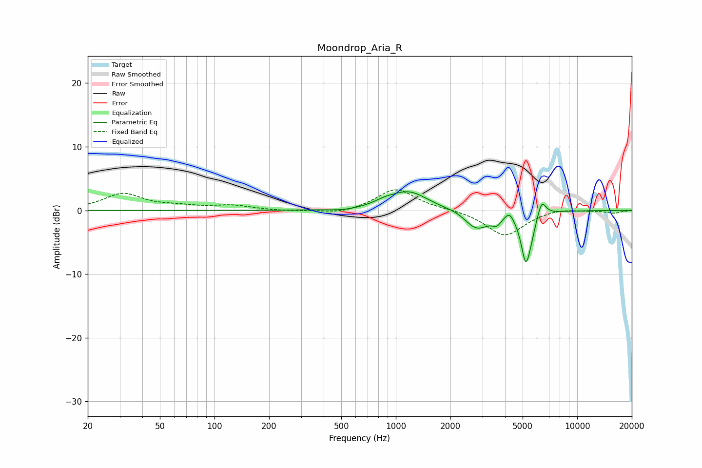

# Moondrop_Aria_R
See [usage instructions](https://github.com/jaakkopasanen/AutoEq#usage) for more options and info.

### Parametric EQs
Apply preamp of -3.0 dB when using parametric equalizer.

|   # | Type    |   Fc (Hz) |    Q |   Gain (dB) |
|-----|---------|-----------|------|-------------|
|   1 | Peaking |       516 | 1.81 |        -0.3 |
|   2 | Peaking |       861 | 2.71 |         0.5 |
|   3 | Peaking |      1174 | 1.32 |         3   |
|   4 | Peaking |      2191 | 2.55 |         0.4 |
|   5 | Peaking |      2785 | 1.96 |        -3.1 |
|   6 | Peaking |      3600 | 6    |        -1.1 |
|   7 | Peaking |      4228 | 6    |         1.3 |
|   8 | Peaking |      5209 | 5.19 |        -7.6 |
|   9 | Peaking |      5610 | 6    |        -1.3 |
|  10 | Peaking |      6372 | 5.95 |         2.5 |

### Fixed Band EQs
When using fixed band (also called graphic) equalizer, apply preamp of **-3.3 dB** (if available) and set gains manually with these parameters.

|   # | Type    |   Fc (Hz) |    Q |   Gain (dB) |
|-----|---------|-----------|------|-------------|
|   1 | Peaking |        31 | 1.41 |         2.6 |
|   2 | Peaking |        62 | 1.41 |         0.5 |
|   3 | Peaking |       125 | 1.41 |         0.7 |
|   4 | Peaking |       250 | 1.41 |        -0.1 |
|   5 | Peaking |       500 | 1.41 |        -0.6 |
|   6 | Peaking |      1000 | 1.41 |         3.4 |
|   7 | Peaking |      2000 | 1.41 |         0.2 |
|   8 | Peaking |      4000 | 1.41 |        -4   |
|   9 | Peaking |      8000 | 1.41 |         0.4 |
|  10 | Peaking |     16000 | 1.41 |        -0.4 |

### Graphs

