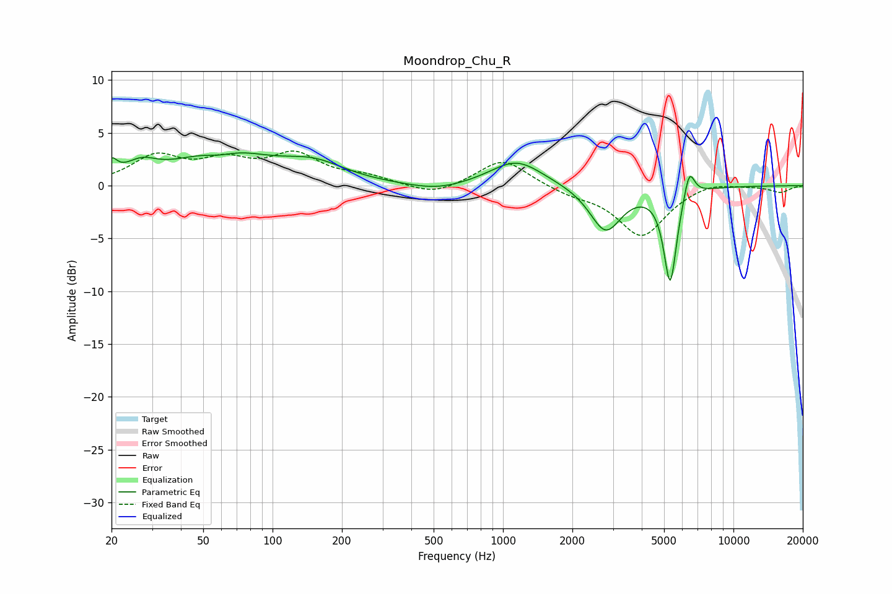

# Moondrop_Chu_R
See [usage instructions](https://github.com/jaakkopasanen/AutoEq#usage) for more options and info.

### Parametric EQs
Apply preamp of -3.2 dB when using parametric equalizer.

|   # | Type    |   Fc (Hz) |    Q |   Gain (dB) |
|-----|---------|-----------|------|-------------|
|   1 | Peaking |        20 | 6    |         1.4 |
|   2 | Peaking |        27 | 2.09 |         1.4 |
|   3 | Peaking |        59 | 2.05 |        -0.6 |
|   4 | Peaking |        61 | 0.72 |         3.2 |
|   5 | Peaking |       152 | 1.05 |         1.7 |
|   6 | Peaking |       516 | 1.16 |        -0.7 |
|   7 | Peaking |      1145 | 1.25 |         2.5 |
|   8 | Peaking |      2787 | 2.06 |        -4.3 |
|   9 | Peaking |      5316 | 4.92 |        -9   |
|  10 | Peaking |      6432 | 5.94 |         2.8 |

### Fixed Band EQs
When using fixed band (also called graphic) equalizer, apply preamp of **-3.4 dB** (if available) and set gains manually with these parameters.

|   # | Type    |   Fc (Hz) |    Q |   Gain (dB) |
|-----|---------|-----------|------|-------------|
|   1 | Peaking |        31 | 1.41 |         2.6 |
|   2 | Peaking |        62 | 1.41 |         2   |
|   3 | Peaking |       125 | 1.41 |         2.7 |
|   4 | Peaking |       250 | 1.41 |         0.7 |
|   5 | Peaking |       500 | 1.41 |        -1   |
|   6 | Peaking |      1000 | 1.41 |         2.6 |
|   7 | Peaking |      2000 | 1.41 |        -0.7 |
|   8 | Peaking |      4000 | 1.41 |        -4.7 |
|   9 | Peaking |      8000 | 1.41 |         0.5 |
|  10 | Peaking |     16000 | 1.41 |        -0.6 |

### Graphs

