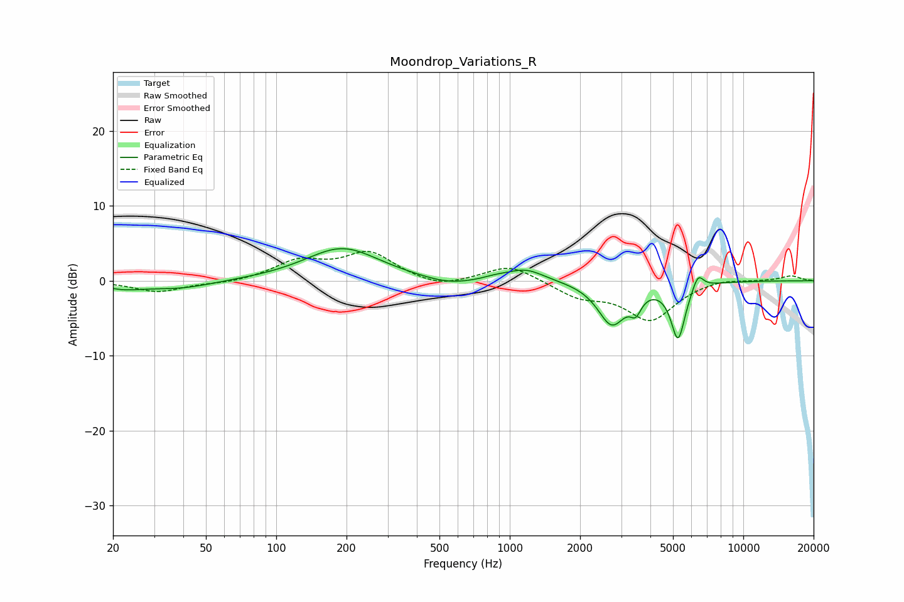

# Moondrop_Variations_R
See [usage instructions](https://github.com/jaakkopasanen/AutoEq#usage) for more options and info.

### Parametric EQs
Apply preamp of -4.4 dB when using parametric equalizer.

|   # | Type    |   Fc (Hz) |    Q |   Gain (dB) |
|-----|---------|-----------|------|-------------|
|   1 | Peaking |        22 | 1.63 |        -0.8 |
|   2 | Peaking |        39 | 0.98 |        -1   |
|   3 | Peaking |       192 | 0.89 |         4.4 |
|   4 | Peaking |       548 | 1.26 |        -0.9 |
|   5 | Peaking |       873 | 2.63 |         0.3 |
|   6 | Peaking |      1169 | 1.78 |         1.6 |
|   7 | Peaking |      2734 | 2.35 |        -5.7 |
|   8 | Peaking |      3464 | 6    |        -2.1 |
|   9 | Peaking |      5256 | 4.56 |        -7.4 |
|  10 | Peaking |      6396 | 5.91 |         2.1 |

### Fixed Band EQs
When using fixed band (also called graphic) equalizer, apply preamp of **-4.0 dB** (if available) and set gains manually with these parameters.

|   # | Type    |   Fc (Hz) |    Q |   Gain (dB) |
|-----|---------|-----------|------|-------------|
|   1 | Peaking |        31 | 1.41 |        -1.5 |
|   2 | Peaking |        62 | 1.41 |        -0.4 |
|   3 | Peaking |       125 | 1.41 |         2.5 |
|   4 | Peaking |       250 | 1.41 |         3.6 |
|   5 | Peaking |       500 | 1.41 |        -1.1 |
|   6 | Peaking |      1000 | 1.41 |         2.2 |
|   7 | Peaking |      2000 | 1.41 |        -2   |
|   8 | Peaking |      4000 | 1.41 |        -5.1 |
|   9 | Peaking |      8000 | 1.41 |         0.5 |
|  10 | Peaking |     16000 | 1.41 |         0.7 |

### Graphs

