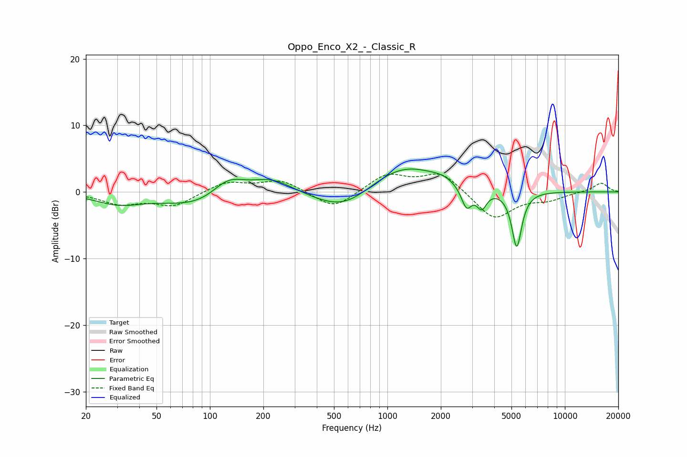

# Oppo_Enco_X2_-_Classic_R
See [usage instructions](https://github.com/jaakkopasanen/AutoEq#usage) for more options and info.

### Parametric EQs
Apply preamp of -3.5 dB when using parametric equalizer.

|   # | Type    |   Fc (Hz) |    Q |   Gain (dB) |
|-----|---------|-----------|------|-------------|
|   1 | Peaking |        30 | 1.09 |        -1.6 |
|   2 | Peaking |        95 | 0.68 |        -2.7 |
|   3 | Peaking |       126 | 1.42 |         3.4 |
|   4 | Peaking |       221 | 1.12 |         2.5 |
|   5 | Peaking |       576 | 0.83 |        -3.8 |
|   6 | Peaking |      1205 | 0.66 |         4.6 |
|   7 | Peaking |      2042 | 2.6  |         0.5 |
|   8 | Peaking |      2791 | 4.7  |        -3.3 |
|   9 | Peaking |      3397 | 4.86 |        -2.7 |
|  10 | Peaking |      5354 | 4.97 |        -8.5 |

### Fixed Band EQs
When using fixed band (also called graphic) equalizer, apply preamp of **-2.8 dB** (if available) and set gains manually with these parameters.

|   # | Type    |   Fc (Hz) |    Q |   Gain (dB) |
|-----|---------|-----------|------|-------------|
|   1 | Peaking |        31 | 1.41 |        -1.7 |
|   2 | Peaking |        62 | 1.41 |        -2.1 |
|   3 | Peaking |       125 | 1.41 |         1.6 |
|   4 | Peaking |       250 | 1.41 |         1.8 |
|   5 | Peaking |       500 | 1.41 |        -2.7 |
|   6 | Peaking |      1000 | 1.41 |         2.6 |
|   7 | Peaking |      2000 | 1.41 |         2.9 |
|   8 | Peaking |      4000 | 1.41 |        -4.2 |
|   9 | Peaking |      8000 | 1.41 |        -1   |
|  10 | Peaking |     16000 | 1.41 |         1.4 |

### Graphs

