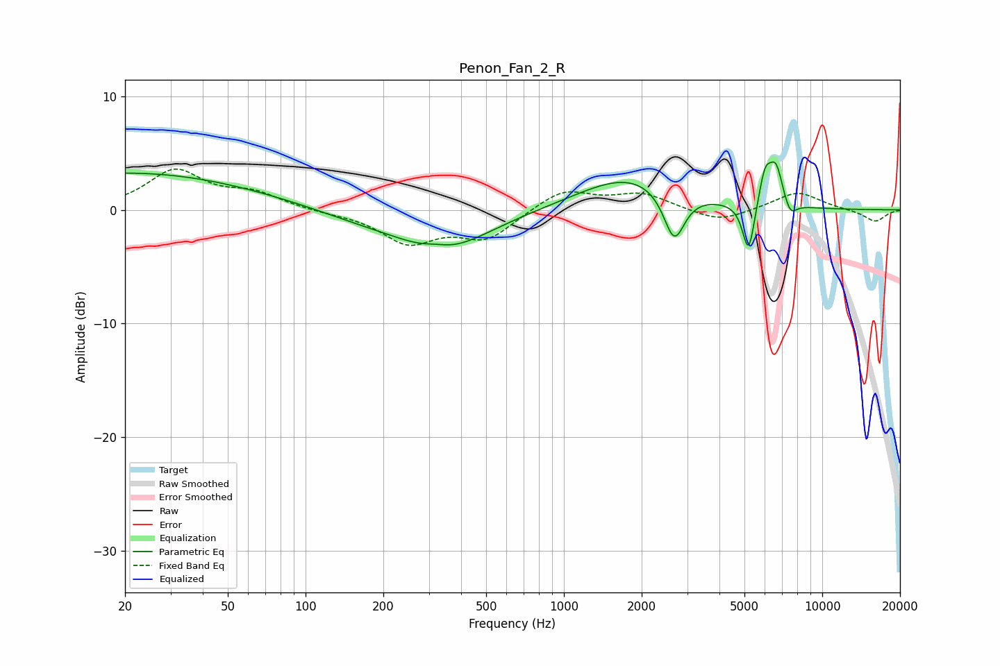

# Penon_Fan_2_R
See [usage instructions](https://github.com/jaakkopasanen/AutoEq#usage) for more options and info.

### Parametric EQs
Apply preamp of -4.3 dB when using parametric equalizer.

|   # | Type    |   Fc (Hz) |    Q |   Gain (dB) |
|-----|---------|-----------|------|-------------|
|   1 | Peaking |        21 | 0.29 |         3.3 |
|   2 | Peaking |       159 | 0.82 |        -0.6 |
|   3 | Peaking |       319 | 2.79 |         0.4 |
|   4 | Peaking |       339 | 0.79 |        -3.5 |
|   5 | Peaking |      1805 | 0.72 |         3.1 |
|   6 | Peaking |      2673 | 3.45 |        -4.5 |
|   7 | Peaking |      5189 | 6    |        -4.6 |
|   8 | Peaking |      6014 | 5.55 |         3   |
|   9 | Peaking |      6628 | 5.21 |         3.3 |
|  10 | Peaking |      7523 | 5.62 |        -1.3 |

### Fixed Band EQs
When using fixed band (also called graphic) equalizer, apply preamp of **-3.7 dB** (if available) and set gains manually with these parameters.

|   # | Type    |   Fc (Hz) |    Q |   Gain (dB) |
|-----|---------|-----------|------|-------------|
|   1 | Peaking |        31 | 1.41 |         3.4 |
|   2 | Peaking |        62 | 1.41 |         1.3 |
|   3 | Peaking |       125 | 1.41 |        -0.2 |
|   4 | Peaking |       250 | 1.41 |        -2.8 |
|   5 | Peaking |       500 | 1.41 |        -2.4 |
|   6 | Peaking |      1000 | 1.41 |         1.8 |
|   7 | Peaking |      2000 | 1.41 |         1.4 |
|   8 | Peaking |      4000 | 1.41 |        -1.1 |
|   9 | Peaking |      8000 | 1.41 |         1.6 |
|  10 | Peaking |     16000 | 1.41 |        -1.1 |

### Graphs

