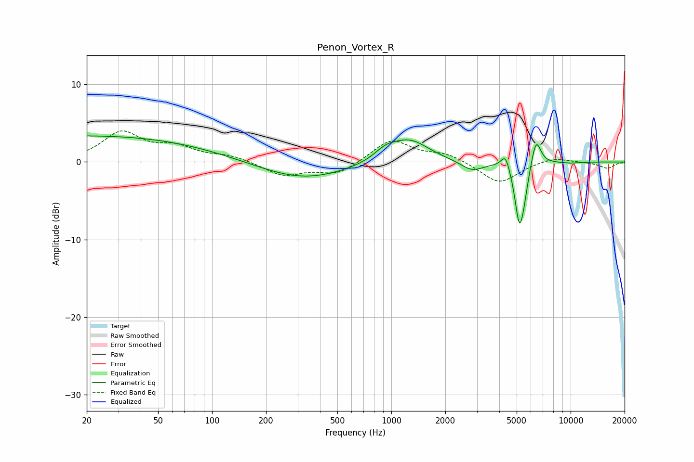

# Penon_Vortex_R
See [usage instructions](https://github.com/jaakkopasanen/AutoEq#usage) for more options and info.

### Parametric EQs
Apply preamp of -3.5 dB when using parametric equalizer.

|   # | Type    |   Fc (Hz) |    Q |   Gain (dB) |
|-----|---------|-----------|------|-------------|
|   1 | Peaking |        20 | 0.18 |         3.4 |
|   2 | Peaking |       321 | 0.58 |        -2.3 |
|   3 | Peaking |       927 | 2.27 |         1.1 |
|   4 | Peaking |      1258 | 1.28 |         2.9 |
|   5 | Peaking |      2818 | 2.23 |        -1.3 |
|   6 | Peaking |      4331 | 5.97 |         1.9 |
|   7 | Peaking |      5175 | 5.44 |        -7.4 |
|   8 | Peaking |      5512 | 6    |        -2   |
|   9 | Peaking |      6418 | 5.17 |         3.5 |
|  10 | Peaking |      9994 | 2.61 |        -0.1 |

### Fixed Band EQs
When using fixed band (also called graphic) equalizer, apply preamp of **-4.1 dB** (if available) and set gains manually with these parameters.

|   # | Type    |   Fc (Hz) |    Q |   Gain (dB) |
|-----|---------|-----------|------|-------------|
|   1 | Peaking |        31 | 1.41 |         3.7 |
|   2 | Peaking |        62 | 1.41 |         1.7 |
|   3 | Peaking |       125 | 1.41 |         0.7 |
|   4 | Peaking |       250 | 1.41 |        -1.7 |
|   5 | Peaking |       500 | 1.41 |        -1.6 |
|   6 | Peaking |      1000 | 1.41 |         2.9 |
|   7 | Peaking |      2000 | 1.41 |         1   |
|   8 | Peaking |      4000 | 1.41 |        -2.8 |
|   9 | Peaking |      8000 | 1.41 |         0.7 |
|  10 | Peaking |     16000 | 1.41 |        -0.8 |

### Graphs

