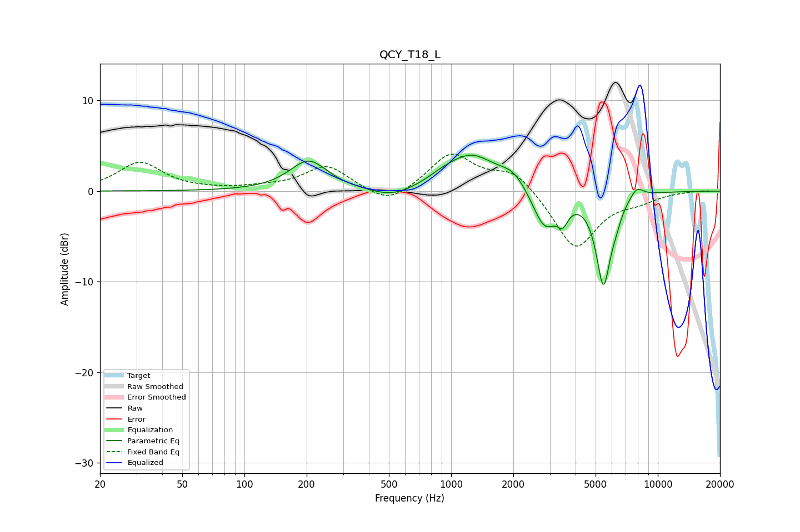

# QCY_T18_L
See [usage instructions](https://github.com/jaakkopasanen/AutoEq#usage) for more options and info.

### Parametric EQs
Apply preamp of -4.1 dB when using parametric equalizer.

|   # | Type    |   Fc (Hz) |    Q |   Gain (dB) |
|-----|---------|-----------|------|-------------|
|   1 | Peaking |       204 | 1.55 |         3.3 |
|   2 | Peaking |       520 | 1.33 |        -1.1 |
|   3 | Peaking |       899 | 2.15 |         0.4 |
|   4 | Peaking |      1248 | 1.16 |         3.9 |
|   5 | Peaking |      2003 | 2.16 |         1.6 |
|   6 | Peaking |      2828 | 2.41 |        -4.3 |
|   7 | Peaking |      3468 | 5.33 |        -1.9 |
|   8 | Peaking |      5458 | 3.86 |       -10   |
|   9 | Peaking |      6267 | 5.1  |        -1.1 |
|  10 | Peaking |      7903 | 4.09 |         1.2 |

### Fixed Band EQs
When using fixed band (also called graphic) equalizer, apply preamp of **-4.2 dB** (if available) and set gains manually with these parameters.

|   # | Type    |   Fc (Hz) |    Q |   Gain (dB) |
|-----|---------|-----------|------|-------------|
|   1 | Peaking |        31 | 1.41 |         3.1 |
|   2 | Peaking |        62 | 1.41 |         0.1 |
|   3 | Peaking |       125 | 1.41 |         0.3 |
|   4 | Peaking |       250 | 1.41 |         2.8 |
|   5 | Peaking |       500 | 1.41 |        -1.8 |
|   6 | Peaking |      1000 | 1.41 |         4.1 |
|   7 | Peaking |      2000 | 1.41 |         2.3 |
|   8 | Peaking |      4000 | 1.41 |        -6.5 |
|   9 | Peaking |      8000 | 1.41 |        -0.8 |
|  10 | Peaking |     16000 | 1.41 |         0.1 |

### Graphs

