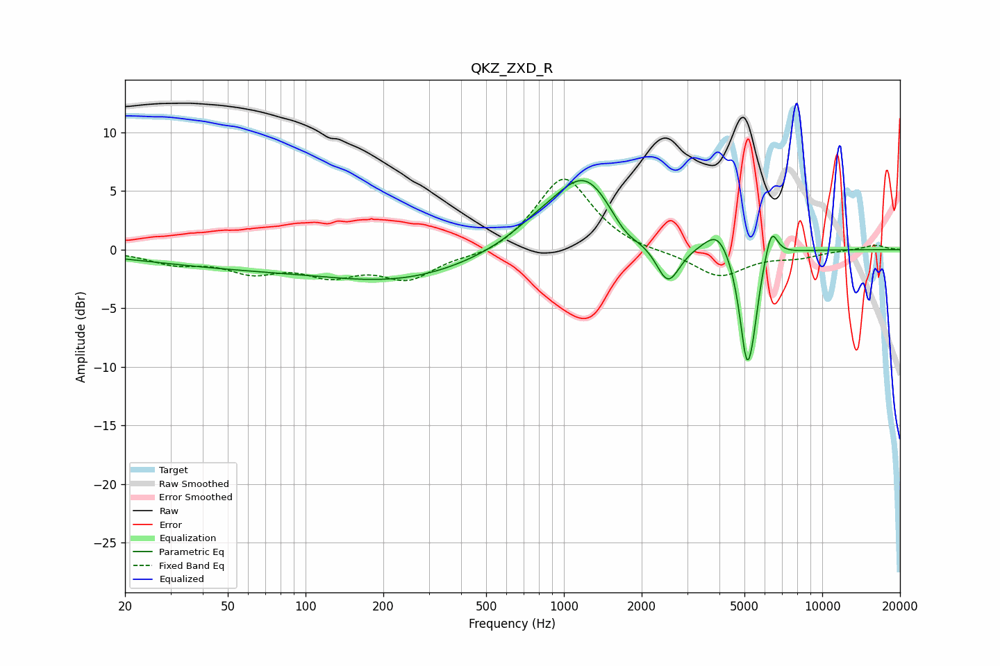

# QKZ_ZXD_R
See [usage instructions](https://github.com/jaakkopasanen/AutoEq#usage) for more options and info.

### Parametric EQs
Apply preamp of -6.0 dB when using parametric equalizer.

|   # | Type    |   Fc (Hz) |    Q |   Gain (dB) |
|-----|---------|-----------|------|-------------|
|   1 | Peaking |        56 | 0.37 |        -1.3 |
|   2 | Peaking |       241 | 0.49 |        -2.2 |
|   3 | Peaking |       788 | 1.22 |         1.1 |
|   4 | Peaking |      1214 | 1.13 |         6.3 |
|   5 | Peaking |      1731 | 2.23 |        -1.6 |
|   6 | Peaking |      2527 | 2.99 |        -3.7 |
|   7 | Peaking |      3945 | 2.76 |         2   |
|   8 | Peaking |      5103 | 4.74 |        -8.9 |
|   9 | Peaking |      5400 | 6    |        -2.2 |
|  10 | Peaking |      6353 | 5.58 |         2.7 |

### Fixed Band EQs
When using fixed band (also called graphic) equalizer, apply preamp of **-6.1 dB** (if available) and set gains manually with these parameters.

|   # | Type    |   Fc (Hz) |    Q |   Gain (dB) |
|-----|---------|-----------|------|-------------|
|   1 | Peaking |        31 | 1.41 |        -1   |
|   2 | Peaking |        62 | 1.41 |        -1.6 |
|   3 | Peaking |       125 | 1.41 |        -1.8 |
|   4 | Peaking |       250 | 1.41 |        -2.3 |
|   5 | Peaking |       500 | 1.41 |        -0.7 |
|   6 | Peaking |      1000 | 1.41 |         6.4 |
|   7 | Peaking |      2000 | 1.41 |        -0.3 |
|   8 | Peaking |      4000 | 1.41 |        -2.3 |
|   9 | Peaking |      8000 | 1.41 |        -0.6 |
|  10 | Peaking |     16000 | 1.41 |         0.4 |

### Graphs

