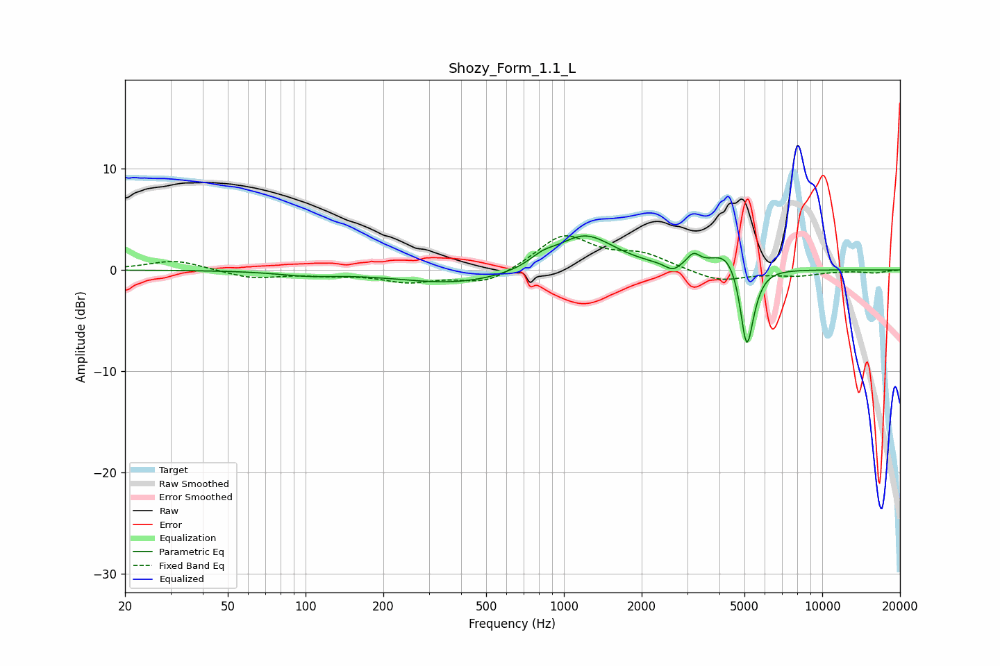

# Shozy_Form_1.1_L
See [usage instructions](https://github.com/jaakkopasanen/AutoEq#usage) for more options and info.

### Parametric EQs
Apply preamp of -3.5 dB when using parametric equalizer.

|   # | Type    |   Fc (Hz) |    Q |   Gain (dB) |
|-----|---------|-----------|------|-------------|
|   1 | Peaking |       101 | 1.24 |        -0.4 |
|   2 | Peaking |       391 | 0.61 |        -1.4 |
|   3 | Peaking |       825 | 2.86 |         0.8 |
|   4 | Peaking |      1192 | 1.29 |         3.4 |
|   5 | Peaking |      1461 | 1.22 |         0.3 |
|   6 | Peaking |      2640 | 4.87 |        -0.8 |
|   7 | Peaking |      3171 | 6    |         1.1 |
|   8 | Peaking |      4280 | 2.3  |         2.1 |
|   9 | Peaking |      5091 | 5.99 |        -7   |
|  10 | Peaking |      5298 | 3.91 |        -1.6 |

### Fixed Band EQs
When using fixed band (also called graphic) equalizer, apply preamp of **-3.5 dB** (if available) and set gains manually with these parameters.

|   # | Type    |   Fc (Hz) |    Q |   Gain (dB) |
|-----|---------|-----------|------|-------------|
|   1 | Peaking |        31 | 1.41 |         1   |
|   2 | Peaking |        62 | 1.41 |        -0.8 |
|   3 | Peaking |       125 | 1.41 |        -0.4 |
|   4 | Peaking |       250 | 1.41 |        -1.1 |
|   5 | Peaking |       500 | 1.41 |        -1.4 |
|   6 | Peaking |      1000 | 1.41 |         3.4 |
|   7 | Peaking |      2000 | 1.41 |         1.4 |
|   8 | Peaking |      4000 | 1.41 |        -1.2 |
|   9 | Peaking |      8000 | 1.41 |        -0.5 |
|  10 | Peaking |     16000 | 1.41 |        -0.3 |

### Graphs

