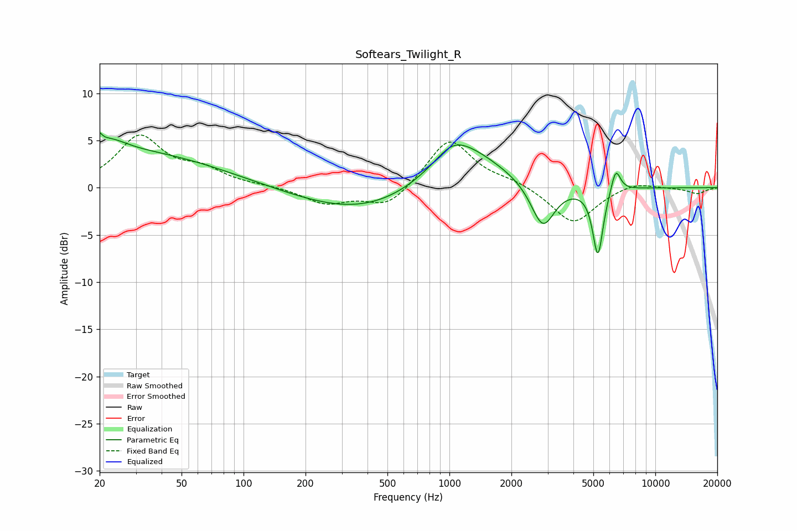

# Softears_Twilight_R
See [usage instructions](https://github.com/jaakkopasanen/AutoEq#usage) for more options and info.

### Parametric EQs
Apply preamp of -5.9 dB when using parametric equalizer.

|   # | Type    |   Fc (Hz) |    Q |   Gain (dB) |
|-----|---------|-----------|------|-------------|
|   1 | Peaking |        20 | 5.76 |         3.1 |
|   2 | Peaking |        20 | 5.94 |        -2   |
|   3 | Peaking |        23 | 1.77 |         1.2 |
|   4 | Peaking |        26 | 0.31 |         3.8 |
|   5 | Peaking |       391 | 0.45 |        -2.8 |
|   6 | Peaking |      1032 | 1.83 |         1.4 |
|   7 | Peaking |      1167 | 0.77 |         4.6 |
|   8 | Peaking |      2841 | 2.45 |        -4.8 |
|   9 | Peaking |      5262 | 5.49 |        -7.2 |
|  10 | Peaking |      6424 | 5.97 |         2.6 |

### Fixed Band EQs
When using fixed band (also called graphic) equalizer, apply preamp of **-5.7 dB** (if available) and set gains manually with these parameters.

|   # | Type    |   Fc (Hz) |    Q |   Gain (dB) |
|-----|---------|-----------|------|-------------|
|   1 | Peaking |        31 | 1.41 |         5.3 |
|   2 | Peaking |        62 | 1.41 |         1.6 |
|   3 | Peaking |       125 | 1.41 |         0.2 |
|   4 | Peaking |       250 | 1.41 |        -1.7 |
|   5 | Peaking |       500 | 1.41 |        -2.1 |
|   6 | Peaking |      1000 | 1.41 |         5.3 |
|   7 | Peaking |      2000 | 1.41 |         0.6 |
|   8 | Peaking |      4000 | 1.41 |        -3.9 |
|   9 | Peaking |      8000 | 1.41 |         0.7 |
|  10 | Peaking |     16000 | 1.41 |        -0.6 |

### Graphs

