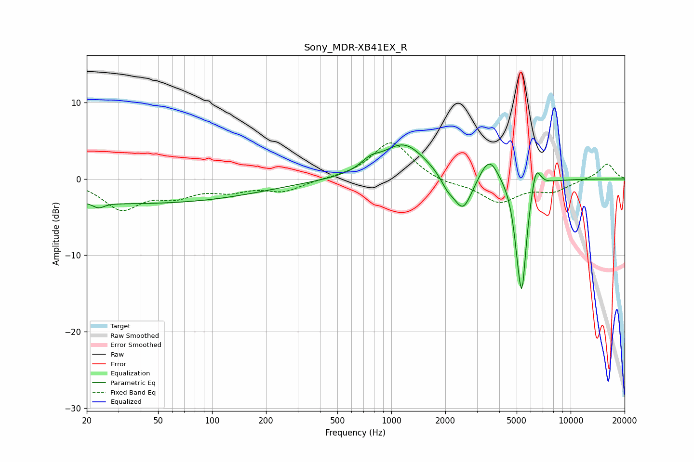

# Sony_MDR-XB41EX_R
See [usage instructions](https://github.com/jaakkopasanen/AutoEq#usage) for more options and info.

### Parametric EQs
Apply preamp of -4.5 dB when using parametric equalizer.

|   # | Type    |   Fc (Hz) |    Q |   Gain (dB) |
|-----|---------|-----------|------|-------------|
|   1 | Peaking |        23 | 4.8  |        -0.7 |
|   2 | Peaking |        36 | 0.18 |        -3.2 |
|   3 | Peaking |       761 | 2.71 |         1.1 |
|   4 | Peaking |      1175 | 1.15 |         4.6 |
|   5 | Peaking |      2053 | 3.79 |        -1.3 |
|   6 | Peaking |      2508 | 2.71 |        -4.7 |
|   7 | Peaking |      3517 | 2.68 |         3.4 |
|   8 | Peaking |      5078 | 6    |        -3.2 |
|   9 | Peaking |      5360 | 5.26 |       -13.3 |
|  10 | Peaking |      6399 | 5.26 |         3.5 |

### Fixed Band EQs
When using fixed band (also called graphic) equalizer, apply preamp of **-4.8 dB** (if available) and set gains manually with these parameters.

|   # | Type    |   Fc (Hz) |    Q |   Gain (dB) |
|-----|---------|-----------|------|-------------|
|   1 | Peaking |        31 | 1.41 |        -3.7 |
|   2 | Peaking |        62 | 1.41 |        -1.9 |
|   3 | Peaking |       125 | 1.41 |        -1.3 |
|   4 | Peaking |       250 | 1.41 |        -1.5 |
|   5 | Peaking |       500 | 1.41 |         0   |
|   6 | Peaking |      1000 | 1.41 |         5   |
|   7 | Peaking |      2000 | 1.41 |        -0.6 |
|   8 | Peaking |      4000 | 1.41 |        -2.9 |
|   9 | Peaking |      8000 | 1.41 |        -1.5 |
|  10 | Peaking |     16000 | 1.41 |         2   |

### Graphs

