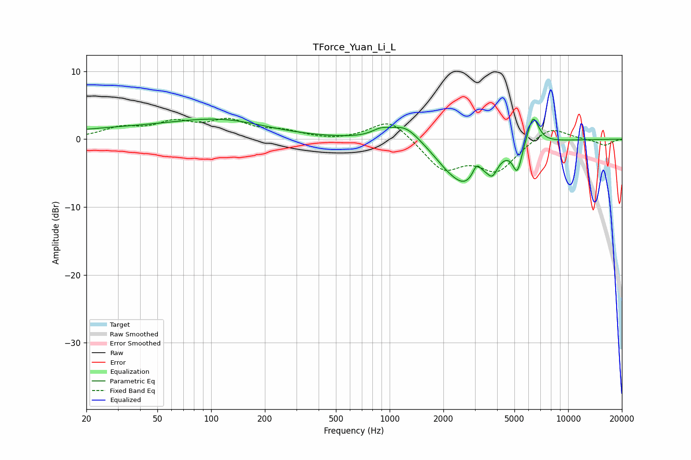

# TForce_Yuan_Li_L
See [usage instructions](https://github.com/jaakkopasanen/AutoEq#usage) for more options and info.

### Parametric EQs
Apply preamp of -3.1 dB when using parametric equalizer.

|   # | Type    |   Fc (Hz) |    Q |   Gain (dB) |
|-----|---------|-----------|------|-------------|
|   1 | Peaking |        45 | 0.26 |         1.6 |
|   2 | Peaking |       118 | 0.58 |         1.7 |
|   3 | Peaking |       892 | 2.78 |         1   |
|   4 | Peaking |      1222 | 1.69 |         2.5 |
|   5 | Peaking |      2039 | 2.08 |        -0.7 |
|   6 | Peaking |      2661 | 1.25 |        -6.5 |
|   7 | Peaking |      3073 | 6    |         2   |
|   8 | Peaking |      3763 | 4.97 |        -2.1 |
|   9 | Peaking |      5192 | 5.48 |        -3.9 |
|  10 | Peaking |      6353 | 4.27 |         4.3 |

### Fixed Band EQs
When using fixed band (also called graphic) equalizer, apply preamp of **-3.2 dB** (if available) and set gains manually with these parameters.

|   # | Type    |   Fc (Hz) |    Q |   Gain (dB) |
|-----|---------|-----------|------|-------------|
|   1 | Peaking |        31 | 1.41 |         1.5 |
|   2 | Peaking |        62 | 1.41 |         2.1 |
|   3 | Peaking |       125 | 1.41 |         2.4 |
|   4 | Peaking |       250 | 1.41 |         1   |
|   5 | Peaking |       500 | 1.41 |        -0.3 |
|   6 | Peaking |      1000 | 1.41 |         3.1 |
|   7 | Peaking |      2000 | 1.41 |        -4.4 |
|   8 | Peaking |      4000 | 1.41 |        -4.4 |
|   9 | Peaking |      8000 | 1.41 |         2   |
|  10 | Peaking |     16000 | 1.41 |        -0.9 |

### Graphs

