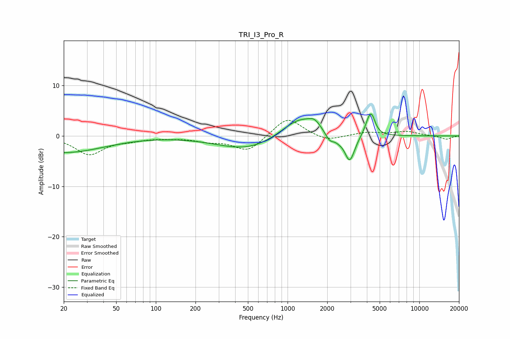

# TRI_I3_Pro_R
See [usage instructions](https://github.com/jaakkopasanen/AutoEq#usage) for more options and info.

### Parametric EQs
Apply preamp of -4.4 dB when using parametric equalizer.

|   # | Type    |   Fc (Hz) |    Q |   Gain (dB) |
|-----|---------|-----------|------|-------------|
|   1 | Peaking |        20 | 0.47 |        -3.3 |
|   2 | Peaking |       501 | 0.62 |        -2.8 |
|   3 | Peaking |      1234 | 1.02 |         4.1 |
|   4 | Peaking |      1603 | 3.18 |         1.3 |
|   5 | Peaking |      2091 | 3.9  |        -1.8 |
|   6 | Peaking |      2453 | 5.31 |        -0.5 |
|   7 | Peaking |      2960 | 3.62 |        -5.5 |
|   8 | Peaking |      4079 | 6    |        -1   |
|   9 | Peaking |      4141 | 4.67 |         4.2 |
|  10 | Peaking |      4405 | 5.78 |         1.9 |

### Fixed Band EQs
When using fixed band (also called graphic) equalizer, apply preamp of **-3.2 dB** (if available) and set gains manually with these parameters.

|   # | Type    |   Fc (Hz) |    Q |   Gain (dB) |
|-----|---------|-----------|------|-------------|
|   1 | Peaking |        31 | 1.41 |        -3.6 |
|   2 | Peaking |        62 | 1.41 |        -0.7 |
|   3 | Peaking |       125 | 1.41 |        -0.3 |
|   4 | Peaking |       250 | 1.41 |        -0.9 |
|   5 | Peaking |       500 | 1.41 |        -3.1 |
|   6 | Peaking |      1000 | 1.41 |         3.8 |
|   7 | Peaking |      2000 | 1.41 |        -1.1 |
|   8 | Peaking |      4000 | 1.41 |         0.7 |
|   9 | Peaking |      8000 | 1.41 |         0.9 |
|  10 | Peaking |     16000 | 1.41 |        -0.7 |

### Graphs

