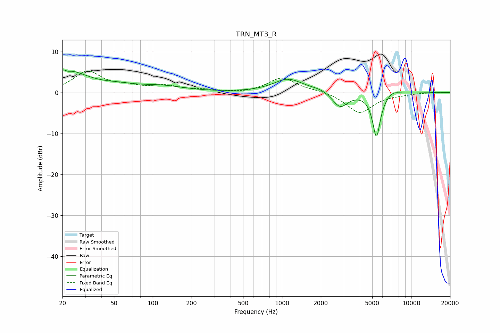

# TRN_MT3_R
See [usage instructions](https://github.com/jaakkopasanen/AutoEq#usage) for more options and info.

### Parametric EQs
Apply preamp of -5.6 dB when using parametric equalizer.

|   # | Type    |   Fc (Hz) |    Q |   Gain (dB) |
|-----|---------|-----------|------|-------------|
|   1 | Peaking |        21 | 0.82 |         5.4 |
|   2 | Peaking |        21 | 5.98 |         3.2 |
|   3 | Peaking |        21 | 5.86 |        -3.4 |
|   4 | Peaking |        54 | 1.18 |         0.8 |
|   5 | Peaking |       115 | 0.77 |         1.4 |
|   6 | Peaking |      1117 | 1.25 |         3.3 |
|   7 | Peaking |      1988 | 1.85 |         0.7 |
|   8 | Peaking |      2818 | 2.37 |        -3.8 |
|   9 | Peaking |      5390 | 4.54 |       -10.8 |
|  10 | Peaking |      7213 | 2.77 |         1   |

### Fixed Band EQs
When using fixed band (also called graphic) equalizer, apply preamp of **-5.4 dB** (if available) and set gains manually with these parameters.

|   # | Type    |   Fc (Hz) |    Q |   Gain (dB) |
|-----|---------|-----------|------|-------------|
|   1 | Peaking |        31 | 1.41 |         5   |
|   2 | Peaking |        62 | 1.41 |         1.2 |
|   3 | Peaking |       125 | 1.41 |         1.4 |
|   4 | Peaking |       250 | 1.41 |         0.5 |
|   5 | Peaking |       500 | 1.41 |        -0.2 |
|   6 | Peaking |      1000 | 1.41 |         3.6 |
|   7 | Peaking |      2000 | 1.41 |         0.5 |
|   8 | Peaking |      4000 | 1.41 |        -5   |
|   9 | Peaking |      8000 | 1.41 |        -0.3 |
|  10 | Peaking |     16000 | 1.41 |         0.1 |

### Graphs

