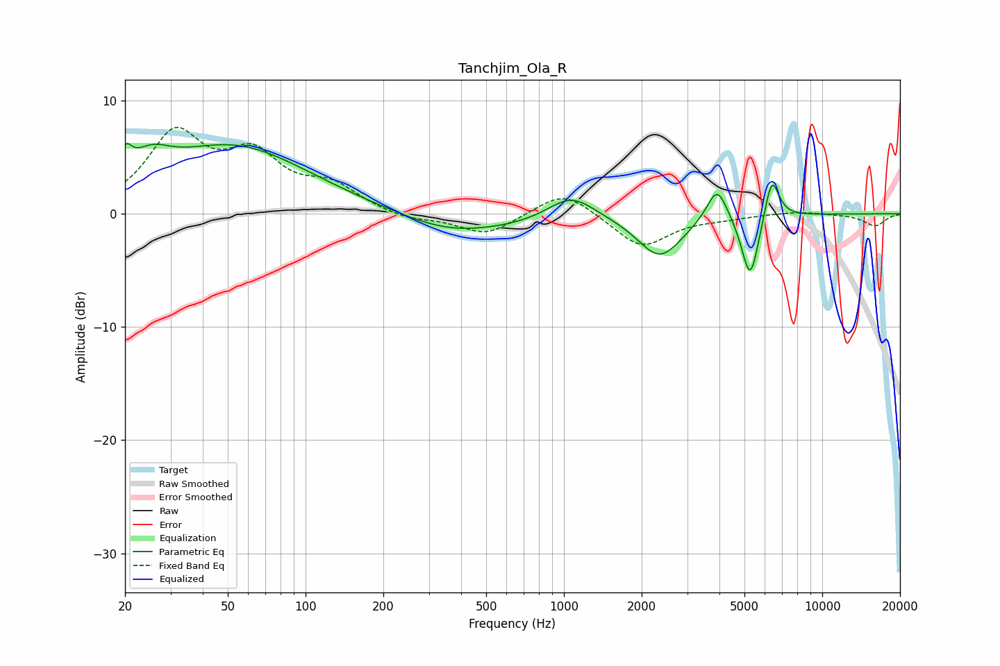

# Tanchjim_Ola_R
See [usage instructions](https://github.com/jaakkopasanen/AutoEq#usage) for more options and info.

### Parametric EQs
Apply preamp of -6.3 dB when using parametric equalizer.

|   # | Type    |   Fc (Hz) |    Q |   Gain (dB) |
|-----|---------|-----------|------|-------------|
|   1 | Peaking |        20 | 6    |         2.1 |
|   2 | Peaking |        25 | 1.82 |         2.2 |
|   3 | Peaking |        53 | 0.48 |         5.9 |
|   4 | Peaking |       352 | 0.77 |        -1.4 |
|   5 | Peaking |       656 | 0.66 |        -0.7 |
|   6 | Peaking |      1066 | 1.55 |         2.3 |
|   7 | Peaking |      2350 | 1.64 |        -3.8 |
|   8 | Peaking |      3919 | 3.5  |         3.2 |
|   9 | Peaking |      5266 | 4.15 |        -5.9 |
|  10 | Peaking |      6378 | 4.87 |         3.9 |

### Fixed Band EQs
When using fixed band (also called graphic) equalizer, apply preamp of **-7.7 dB** (if available) and set gains manually with these parameters.

|   # | Type    |   Fc (Hz) |    Q |   Gain (dB) |
|-----|---------|-----------|------|-------------|
|   1 | Peaking |        31 | 1.41 |         6.7 |
|   2 | Peaking |        62 | 1.41 |         4.5 |
|   3 | Peaking |       125 | 1.41 |         2.2 |
|   4 | Peaking |       250 | 1.41 |        -0.6 |
|   5 | Peaking |       500 | 1.41 |        -1.9 |
|   6 | Peaking |      1000 | 1.41 |         2.2 |
|   7 | Peaking |      2000 | 1.41 |        -3   |
|   8 | Peaking |      4000 | 1.41 |        -0.3 |
|   9 | Peaking |      8000 | 1.41 |         0.3 |
|  10 | Peaking |     16000 | 1.41 |        -1.1 |

### Graphs

