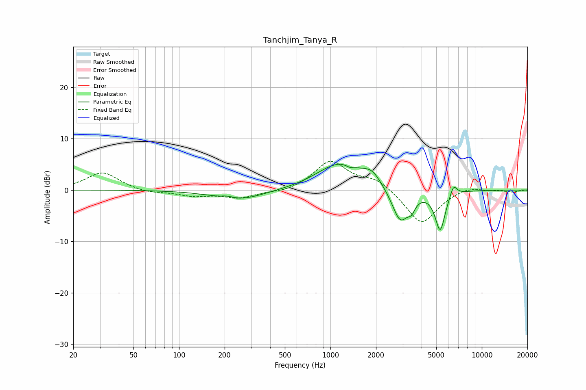

# Tanchjim_Tanya_R
See [usage instructions](https://github.com/jaakkopasanen/AutoEq#usage) for more options and info.

### Parametric EQs
Apply preamp of -5.1 dB when using parametric equalizer.

|   # | Type    |   Fc (Hz) |    Q |   Gain (dB) |
|-----|---------|-----------|------|-------------|
|   1 | Peaking |       209 | 3.39 |         0.5 |
|   2 | Peaking |       247 | 0.88 |        -2   |
|   3 | Peaking |       913 | 1.22 |         0.6 |
|   4 | Peaking |      1205 | 0.96 |         4.9 |
|   5 | Peaking |      1353 | 4.6  |        -0.6 |
|   6 | Peaking |      1886 | 2.43 |         2.1 |
|   7 | Peaking |      2893 | 2.52 |        -6.6 |
|   8 | Peaking |      3434 | 6    |        -1.7 |
|   9 | Peaking |      5309 | 4.17 |        -7.7 |
|  10 | Peaking |      6499 | 6    |         2.3 |

### Fixed Band EQs
When using fixed band (also called graphic) equalizer, apply preamp of **-5.7 dB** (if available) and set gains manually with these parameters.

|   # | Type    |   Fc (Hz) |    Q |   Gain (dB) |
|-----|---------|-----------|------|-------------|
|   1 | Peaking |        31 | 1.41 |         3.5 |
|   2 | Peaking |        62 | 1.41 |        -0.6 |
|   3 | Peaking |       125 | 1.41 |        -1.1 |
|   4 | Peaking |       250 | 1.41 |        -1.5 |
|   5 | Peaking |       500 | 1.41 |        -0.6 |
|   6 | Peaking |      1000 | 1.41 |         5.6 |
|   7 | Peaking |      2000 | 1.41 |         2.1 |
|   8 | Peaking |      4000 | 1.41 |        -6.8 |
|   9 | Peaking |      8000 | 1.41 |         0.9 |
|  10 | Peaking |     16000 | 1.41 |        -0.4 |

### Graphs

