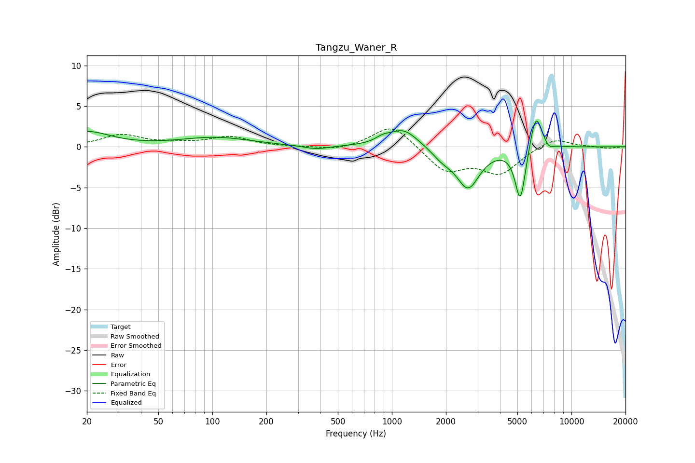

# Tangzu_Waner_R
See [usage instructions](https://github.com/jaakkopasanen/AutoEq#usage) for more options and info.

### Parametric EQs
Apply preamp of -3.3 dB when using parametric equalizer.

|   # | Type    |   Fc (Hz) |    Q |   Gain (dB) |
|-----|---------|-----------|------|-------------|
|   1 | Peaking |        20 | 1.11 |         1.8 |
|   2 | Peaking |       104 | 0.72 |         1.1 |
|   3 | Peaking |       379 | 2    |        -0.5 |
|   4 | Peaking |       889 | 3.55 |         0.5 |
|   5 | Peaking |      1160 | 1.74 |         2.2 |
|   6 | Peaking |      1915 | 2.44 |        -1.1 |
|   7 | Peaking |      2655 | 2.19 |        -4.9 |
|   8 | Peaking |      5193 | 4.81 |        -6.8 |
|   9 | Peaking |      6341 | 4.1  |         4.7 |
|  10 | Peaking |      7491 | 6    |        -0.6 |

### Fixed Band EQs
When using fixed band (also called graphic) equalizer, apply preamp of **-2.3 dB** (if available) and set gains manually with these parameters.

|   # | Type    |   Fc (Hz) |    Q |   Gain (dB) |
|-----|---------|-----------|------|-------------|
|   1 | Peaking |        31 | 1.41 |         1.4 |
|   2 | Peaking |        62 | 1.41 |         0.3 |
|   3 | Peaking |       125 | 1.41 |         1.2 |
|   4 | Peaking |       250 | 1.41 |        -0   |
|   5 | Peaking |       500 | 1.41 |        -0.5 |
|   6 | Peaking |      1000 | 1.41 |         2.9 |
|   7 | Peaking |      2000 | 1.41 |        -3   |
|   8 | Peaking |      4000 | 1.41 |        -3.1 |
|   9 | Peaking |      8000 | 1.41 |         1.2 |
|  10 | Peaking |     16000 | 1.41 |        -0.2 |

### Graphs

