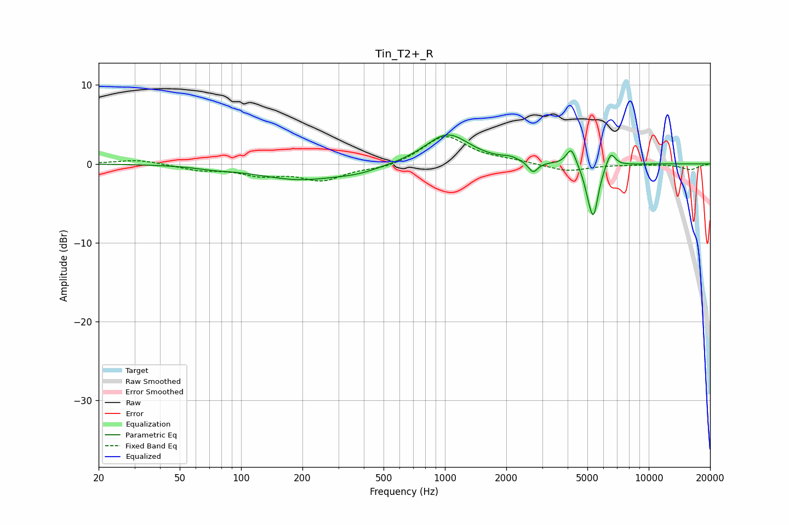

# Tin_T2+_R
See [usage instructions](https://github.com/jaakkopasanen/AutoEq#usage) for more options and info.

### Parametric EQs
Apply preamp of -3.8 dB when using parametric equalizer.

|   # | Type    |   Fc (Hz) |    Q |   Gain (dB) |
|-----|---------|-----------|------|-------------|
|   1 | Peaking |        74 | 1.63 |        -0.3 |
|   2 | Peaking |       193 | 0.67 |        -1.9 |
|   3 | Peaking |       378 | 1.28 |        -0.6 |
|   4 | Peaking |      1028 | 1.31 |         3.9 |
|   5 | Peaking |      2102 | 3.48 |         0.4 |
|   6 | Peaking |      2706 | 6    |        -1.4 |
|   7 | Peaking |      4164 | 6    |         2.3 |
|   8 | Peaking |      5047 | 6    |        -1.3 |
|   9 | Peaking |      5359 | 5.71 |        -6.1 |
|  10 | Peaking |      6507 | 6    |         1.9 |

### Fixed Band EQs
When using fixed band (also called graphic) equalizer, apply preamp of **-3.5 dB** (if available) and set gains manually with these parameters.

|   # | Type    |   Fc (Hz) |    Q |   Gain (dB) |
|-----|---------|-----------|------|-------------|
|   1 | Peaking |        31 | 1.41 |         0.6 |
|   2 | Peaking |        62 | 1.41 |        -0.7 |
|   3 | Peaking |       125 | 1.41 |        -1.2 |
|   4 | Peaking |       250 | 1.41 |        -1.9 |
|   5 | Peaking |       500 | 1.41 |        -0.6 |
|   6 | Peaking |      1000 | 1.41 |         3.6 |
|   7 | Peaking |      2000 | 1.41 |         0.3 |
|   8 | Peaking |      4000 | 1.41 |        -1   |
|   9 | Peaking |      8000 | 1.41 |        -0.1 |
|  10 | Peaking |     16000 | 1.41 |        -0.7 |

### Graphs

