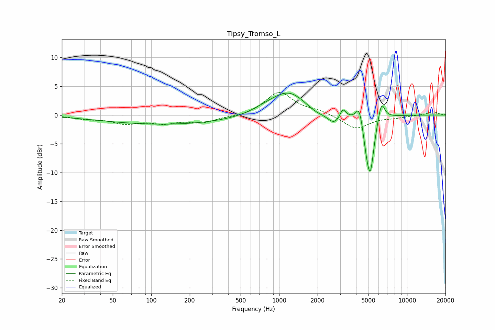

# Tipsy_Tromso_L
See [usage instructions](https://github.com/jaakkopasanen/AutoEq#usage) for more options and info.

### Parametric EQs
Apply preamp of -3.9 dB when using parametric equalizer.

|   # | Type    |   Fc (Hz) |    Q |   Gain (dB) |
|-----|---------|-----------|------|-------------|
|   1 | Peaking |       136 | 0.26 |        -1.6 |
|   2 | Peaking |       778 | 1.37 |         0.6 |
|   3 | Peaking |      1190 | 1.03 |         4   |
|   4 | Peaking |      1925 | 1.96 |        -0.8 |
|   5 | Peaking |      2699 | 2.66 |        -1.9 |
|   6 | Peaking |      3147 | 5.94 |         1.7 |
|   7 | Peaking |      4221 | 5.64 |         2.8 |
|   8 | Peaking |      4812 | 6    |        -2.4 |
|   9 | Peaking |      5170 | 4.61 |        -9.5 |
|  10 | Peaking |      6307 | 5.14 |         3.4 |

### Fixed Band EQs
When using fixed band (also called graphic) equalizer, apply preamp of **-4.0 dB** (if available) and set gains manually with these parameters.

|   # | Type    |   Fc (Hz) |    Q |   Gain (dB) |
|-----|---------|-----------|------|-------------|
|   1 | Peaking |        31 | 1.41 |        -0.6 |
|   2 | Peaking |        62 | 1.41 |        -1.3 |
|   3 | Peaking |       125 | 1.41 |        -1.2 |
|   4 | Peaking |       250 | 1.41 |        -1.2 |
|   5 | Peaking |       500 | 1.41 |        -0.3 |
|   6 | Peaking |      1000 | 1.41 |         4   |
|   7 | Peaking |      2000 | 1.41 |         0.6 |
|   8 | Peaking |      4000 | 1.41 |        -2.4 |
|   9 | Peaking |      8000 | 1.41 |        -0.4 |
|  10 | Peaking |     16000 | 1.41 |         0.6 |

### Graphs

