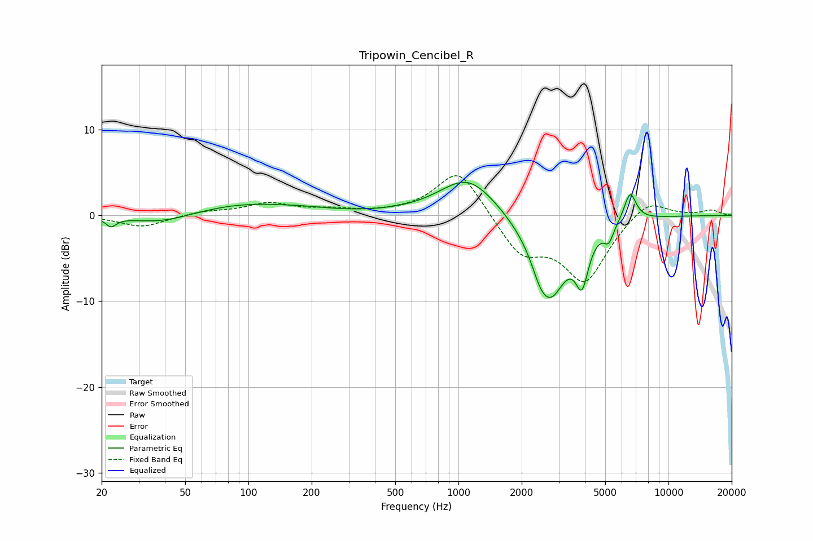

# Tripowin_Cencibel_R
See [usage instructions](https://github.com/jaakkopasanen/AutoEq#usage) for more options and info.

### Parametric EQs
Apply preamp of -4.0 dB when using parametric equalizer.

|   # | Type    |   Fc (Hz) |    Q |   Gain (dB) |
|-----|---------|-----------|------|-------------|
|   1 | Peaking |        22 | 5.86 |        -1   |
|   2 | Peaking |        39 | 0.91 |        -1.2 |
|   3 | Peaking |        95 | 0.54 |         1.4 |
|   4 | Peaking |       186 | 1.21 |         0.2 |
|   5 | Peaking |      1111 | 1.04 |         4.6 |
|   6 | Peaking |      2440 | 3.9  |        -1.2 |
|   7 | Peaking |      2733 | 1.68 |        -9.3 |
|   8 | Peaking |      3876 | 4.59 |        -5.3 |
|   9 | Peaking |      5197 | 6    |        -1.8 |
|  10 | Peaking |      6568 | 4.76 |         3.4 |

### Fixed Band EQs
When using fixed band (also called graphic) equalizer, apply preamp of **-4.7 dB** (if available) and set gains manually with these parameters.

|   # | Type    |   Fc (Hz) |    Q |   Gain (dB) |
|-----|---------|-----------|------|-------------|
|   1 | Peaking |        31 | 1.41 |        -1.4 |
|   2 | Peaking |        62 | 1.41 |         0.5 |
|   3 | Peaking |       125 | 1.41 |         1.3 |
|   4 | Peaking |       250 | 1.41 |         0.5 |
|   5 | Peaking |       500 | 1.41 |         0.2 |
|   6 | Peaking |      1000 | 1.41 |         5.6 |
|   7 | Peaking |      2000 | 1.41 |        -4.3 |
|   8 | Peaking |      4000 | 1.41 |        -7.5 |
|   9 | Peaking |      8000 | 1.41 |         2.2 |
|  10 | Peaking |     16000 | 1.41 |         0.6 |

### Graphs

