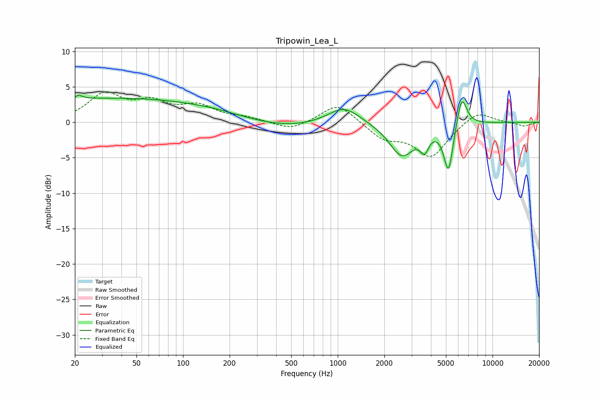

# Tripowin_Lea_L
See [usage instructions](https://github.com/jaakkopasanen/AutoEq#usage) for more options and info.

### Parametric EQs
Apply preamp of -3.9 dB when using parametric equalizer.

|   # | Type    |   Fc (Hz) |    Q |   Gain (dB) |
|-----|---------|-----------|------|-------------|
|   1 | Peaking |        20 | 6    |        -3.1 |
|   2 | Peaking |        20 | 5.52 |         3.4 |
|   3 | Peaking |        38 | 0.18 |         3.4 |
|   4 | Peaking |       163 | 1.78 |         0.1 |
|   5 | Peaking |       431 | 0.59 |        -1   |
|   6 | Peaking |      1095 | 1.39 |         2.5 |
|   7 | Peaking |      2596 | 1.73 |        -4.7 |
|   8 | Peaking |      3636 | 5.16 |        -2.4 |
|   9 | Peaking |      5199 | 4.53 |        -6.9 |
|  10 | Peaking |      6314 | 4.1  |         4.6 |

### Fixed Band EQs
When using fixed band (also called graphic) equalizer, apply preamp of **-4.4 dB** (if available) and set gains manually with these parameters.

|   # | Type    |   Fc (Hz) |    Q |   Gain (dB) |
|-----|---------|-----------|------|-------------|
|   1 | Peaking |        31 | 1.41 |         3.8 |
|   2 | Peaking |        62 | 1.41 |         2.4 |
|   3 | Peaking |       125 | 1.41 |         2.1 |
|   4 | Peaking |       250 | 1.41 |         0.6 |
|   5 | Peaking |       500 | 1.41 |        -1.2 |
|   6 | Peaking |      1000 | 1.41 |         2.8 |
|   7 | Peaking |      2000 | 1.41 |        -2.2 |
|   8 | Peaking |      4000 | 1.41 |        -4.8 |
|   9 | Peaking |      8000 | 1.41 |         1.7 |
|  10 | Peaking |     16000 | 1.41 |        -0.6 |

### Graphs

