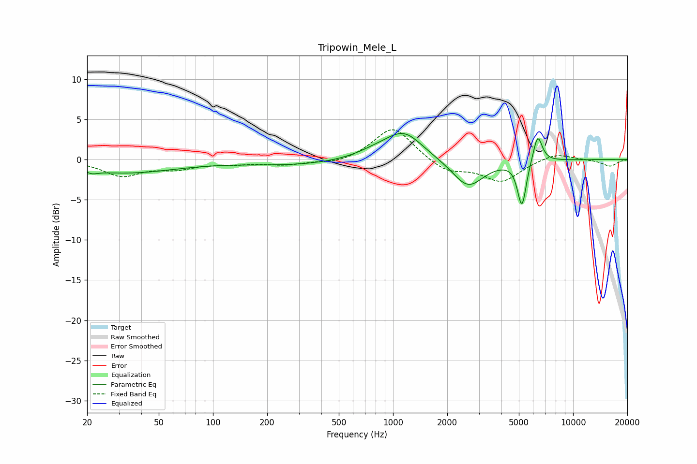

# Tripowin_Mele_L
See [usage instructions](https://github.com/jaakkopasanen/AutoEq#usage) for more options and info.

### Parametric EQs
Apply preamp of -3.3 dB when using parametric equalizer.

|   # | Type    |   Fc (Hz) |    Q |   Gain (dB) |
|-----|---------|-----------|------|-------------|
|   1 | Peaking |        21 | 5.65 |        -1.5 |
|   2 | Peaking |        21 | 5.99 |         1.2 |
|   3 | Peaking |        32 | 0.5  |        -1.6 |
|   4 | Peaking |       289 | 0.49 |        -0.7 |
|   5 | Peaking |       806 | 1.25 |         0.8 |
|   6 | Peaking |      1153 | 1.36 |         3.3 |
|   7 | Peaking |      2610 | 1.62 |        -3.5 |
|   8 | Peaking |      5059 | 6    |        -0.9 |
|   9 | Peaking |      5219 | 6    |        -4.9 |
|  10 | Peaking |      6359 | 5.47 |         3.5 |

### Fixed Band EQs
When using fixed band (also called graphic) equalizer, apply preamp of **-3.8 dB** (if available) and set gains manually with these parameters.

|   # | Type    |   Fc (Hz) |    Q |   Gain (dB) |
|-----|---------|-----------|------|-------------|
|   1 | Peaking |        31 | 1.41 |        -1.9 |
|   2 | Peaking |        62 | 1.41 |        -1   |
|   3 | Peaking |       125 | 1.41 |        -0.4 |
|   4 | Peaking |       250 | 1.41 |        -0.6 |
|   5 | Peaking |       500 | 1.41 |        -0.6 |
|   6 | Peaking |      1000 | 1.41 |         4.2 |
|   7 | Peaking |      2000 | 1.41 |        -1.6 |
|   8 | Peaking |      4000 | 1.41 |        -2.7 |
|   9 | Peaking |      8000 | 1.41 |         0.9 |
|  10 | Peaking |     16000 | 1.41 |        -0.8 |

### Graphs

