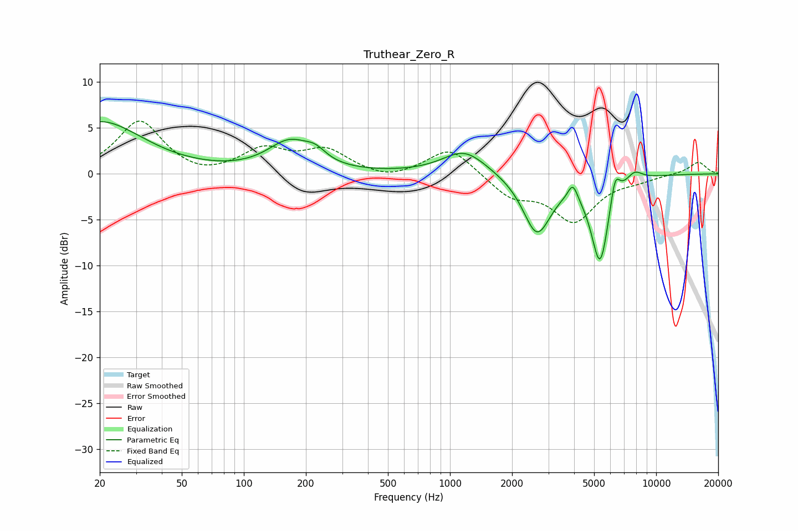

# Truthear_Zero_R
See [usage instructions](https://github.com/jaakkopasanen/AutoEq#usage) for more options and info.

### Parametric EQs
Apply preamp of -5.8 dB when using parametric equalizer.

|   # | Type    |   Fc (Hz) |    Q |   Gain (dB) |
|-----|---------|-----------|------|-------------|
|   1 | Peaking |        20 | 0.68 |         5.7 |
|   2 | Peaking |       167 | 1.33 |         3.3 |
|   3 | Peaking |       223 | 2.83 |         1.1 |
|   4 | Peaking |      1176 | 1.33 |         2.6 |
|   5 | Peaking |      2641 | 2.05 |        -0.5 |
|   6 | Peaking |      2642 | 2.08 |        -5.9 |
|   7 | Peaking |      3943 | 6    |         1.8 |
|   8 | Peaking |      5345 | 3.14 |        -9.5 |
|   9 | Peaking |      6320 | 6    |         3.1 |
|  10 | Peaking |      7842 | 3.44 |         1.1 |

### Fixed Band EQs
When using fixed band (also called graphic) equalizer, apply preamp of **-5.8 dB** (if available) and set gains manually with these parameters.

|   # | Type    |   Fc (Hz) |    Q |   Gain (dB) |
|-----|---------|-----------|------|-------------|
|   1 | Peaking |        31 | 1.41 |         5.8 |
|   2 | Peaking |        62 | 1.41 |        -0.6 |
|   3 | Peaking |       125 | 1.41 |         2.5 |
|   4 | Peaking |       250 | 1.41 |         2.4 |
|   5 | Peaking |       500 | 1.41 |        -0.8 |
|   6 | Peaking |      1000 | 1.41 |         3   |
|   7 | Peaking |      2000 | 1.41 |        -2.3 |
|   8 | Peaking |      4000 | 1.41 |        -5   |
|   9 | Peaking |      8000 | 1.41 |        -0.5 |
|  10 | Peaking |     16000 | 1.41 |         1.3 |

### Graphs

