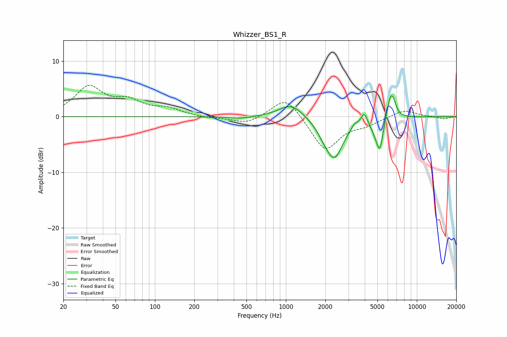

# Whizzer_BS1_R
See [usage instructions](https://github.com/jaakkopasanen/AutoEq#usage) for more options and info.

### Parametric EQs
Apply preamp of -3.8 dB when using parametric equalizer.

|   # | Type    |   Fc (Hz) |    Q |   Gain (dB) |
|-----|---------|-----------|------|-------------|
|   1 | Peaking |       452 | 1.66 |        -0.4 |
|   2 | Peaking |      1097 | 1.54 |         2.5 |
|   3 | Peaking |      1922 | 3.05 |        -0.9 |
|   4 | Peaking |      2335 | 2.03 |        -7.3 |
|   5 | Peaking |      3340 | 6    |         0.7 |
|   6 | Peaking |      3959 | 5.99 |         2.1 |
|   7 | Peaking |      4796 | 4.18 |        -1.6 |
|   8 | Peaking |      5220 | 5.61 |        -5.1 |
|   9 | Peaking |      6285 | 5.13 |         3.8 |
|  10 | Peaking |      6639 | 5.99 |         1.6 |

### Fixed Band EQs
When using fixed band (also called graphic) equalizer, apply preamp of **-5.7 dB** (if available) and set gains manually with these parameters.

|   # | Type    |   Fc (Hz) |    Q |   Gain (dB) |
|-----|---------|-----------|------|-------------|
|   1 | Peaking |        31 | 1.41 |         5.1 |
|   2 | Peaking |        62 | 1.41 |         2.4 |
|   3 | Peaking |       125 | 1.41 |         1.2 |
|   4 | Peaking |       250 | 1.41 |        -0.3 |
|   5 | Peaking |       500 | 1.41 |        -1.3 |
|   6 | Peaking |      1000 | 1.41 |         3.9 |
|   7 | Peaking |      2000 | 1.41 |        -6.2 |
|   8 | Peaking |      4000 | 1.41 |        -1.2 |
|   9 | Peaking |      8000 | 1.41 |         1.3 |
|  10 | Peaking |     16000 | 1.41 |        -0.4 |

### Graphs

