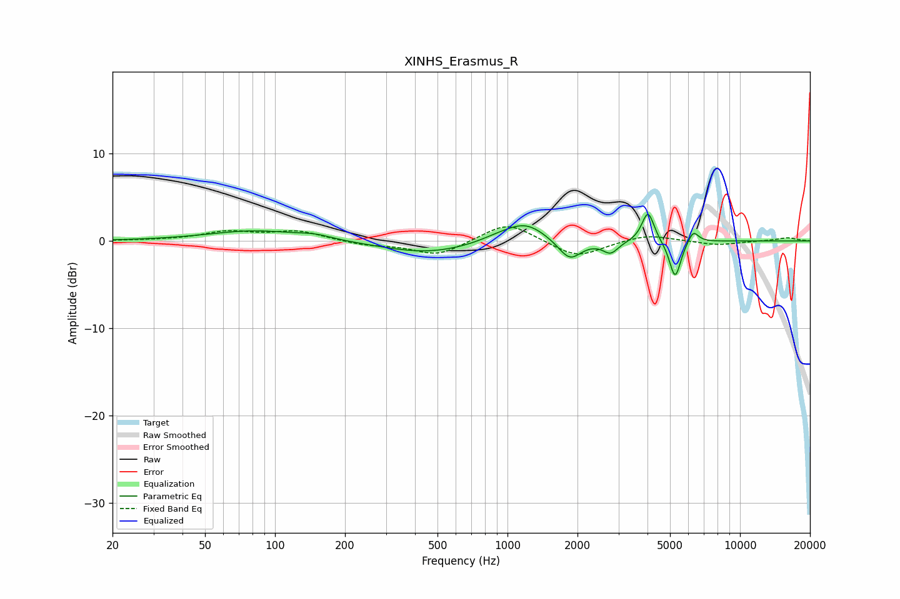

# XINHS_Erasmus_R
See [usage instructions](https://github.com/jaakkopasanen/AutoEq#usage) for more options and info.

### Parametric EQs
Apply preamp of -3.1 dB when using parametric equalizer.

|   # | Type    |   Fc (Hz) |    Q |   Gain (dB) |
|-----|---------|-----------|------|-------------|
|   1 | Peaking |        82 | 0.72 |         1.2 |
|   2 | Peaking |       148 | 1.97 |         0.4 |
|   3 | Peaking |       451 | 0.72 |        -1.4 |
|   4 | Peaking |       929 | 1.58 |         0.6 |
|   5 | Peaking |      1204 | 1.65 |         2   |
|   6 | Peaking |      1852 | 2.88 |        -2.3 |
|   7 | Peaking |      2775 | 4.3  |        -1.3 |
|   8 | Peaking |      4020 | 5.43 |         3.5 |
|   9 | Peaking |      5260 | 5.73 |        -4.4 |
|  10 | Peaking |      6290 | 6    |         1.4 |

### Fixed Band EQs
When using fixed band (also called graphic) equalizer, apply preamp of **-1.7 dB** (if available) and set gains manually with these parameters.

|   # | Type    |   Fc (Hz) |    Q |   Gain (dB) |
|-----|---------|-----------|------|-------------|
|   1 | Peaking |        31 | 1.41 |         0   |
|   2 | Peaking |        62 | 1.41 |         1   |
|   3 | Peaking |       125 | 1.41 |         1.1 |
|   4 | Peaking |       250 | 1.41 |        -0.5 |
|   5 | Peaking |       500 | 1.41 |        -1.7 |
|   6 | Peaking |      1000 | 1.41 |         2.3 |
|   7 | Peaking |      2000 | 1.41 |        -2   |
|   8 | Peaking |      4000 | 1.41 |         0.8 |
|   9 | Peaking |      8000 | 1.41 |        -0.5 |
|  10 | Peaking |     16000 | 1.41 |         0.4 |

### Graphs

