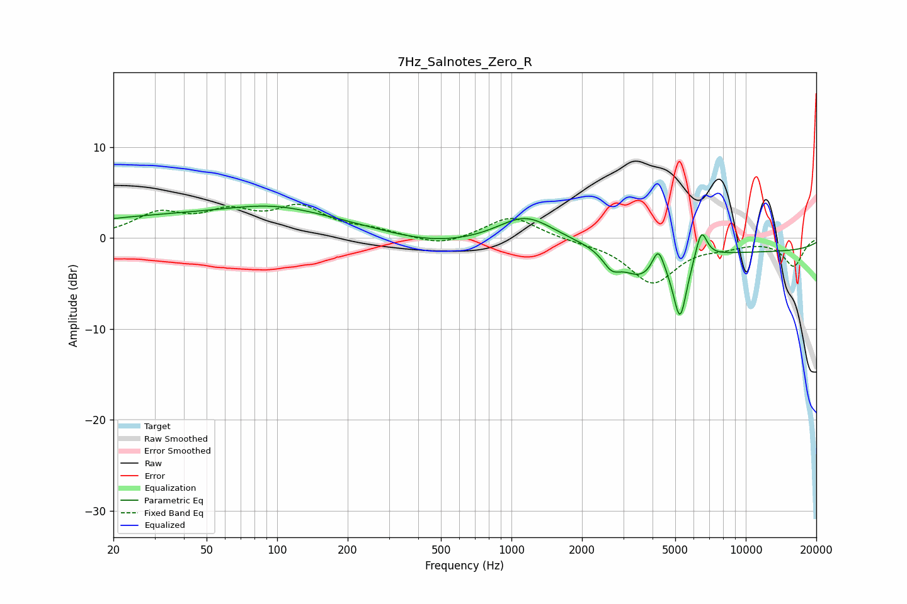

# 7Hz_Salnotes_Zero_R
See [usage instructions](https://github.com/jaakkopasanen/AutoEq#usage) for more options and info.

### Parametric EQs
Apply preamp of -3.6 dB when using parametric equalizer.

|   # | Type    |   Fc (Hz) |    Q |   Gain (dB) |
|-----|---------|-----------|------|-------------|
|   1 | Peaking |        62 | 0.18 |         2.6 |
|   2 | Peaking |        97 | 0.76 |         1.1 |
|   3 | Peaking |       450 | 0.59 |        -1.4 |
|   4 | Peaking |      1148 | 1.19 |         2.9 |
|   5 | Peaking |      2676 | 3.79 |        -1.7 |
|   6 | Peaking |      3549 | 1.73 |        -2.9 |
|   7 | Peaking |      4230 | 5.67 |         2.7 |
|   8 | Peaking |      5241 | 4.66 |        -7   |
|   9 | Peaking |      6463 | 5.61 |         3.3 |
|  10 | Peaking |     10000 | 0.18 |        -1.5 |

### Fixed Band EQs
When using fixed band (also called graphic) equalizer, apply preamp of **-3.8 dB** (if available) and set gains manually with these parameters.

|   # | Type    |   Fc (Hz) |    Q |   Gain (dB) |
|-----|---------|-----------|------|-------------|
|   1 | Peaking |        31 | 1.41 |         2.5 |
|   2 | Peaking |        62 | 1.41 |         2.4 |
|   3 | Peaking |       125 | 1.41 |         3.1 |
|   4 | Peaking |       250 | 1.41 |         0.7 |
|   5 | Peaking |       500 | 1.41 |        -1   |
|   6 | Peaking |      1000 | 1.41 |         2.5 |
|   7 | Peaking |      2000 | 1.41 |        -0.3 |
|   8 | Peaking |      4000 | 1.41 |        -4.9 |
|   9 | Peaking |      8000 | 1.41 |        -0.6 |
|  10 | Peaking |     16000 | 1.41 |        -3   |

### Graphs

