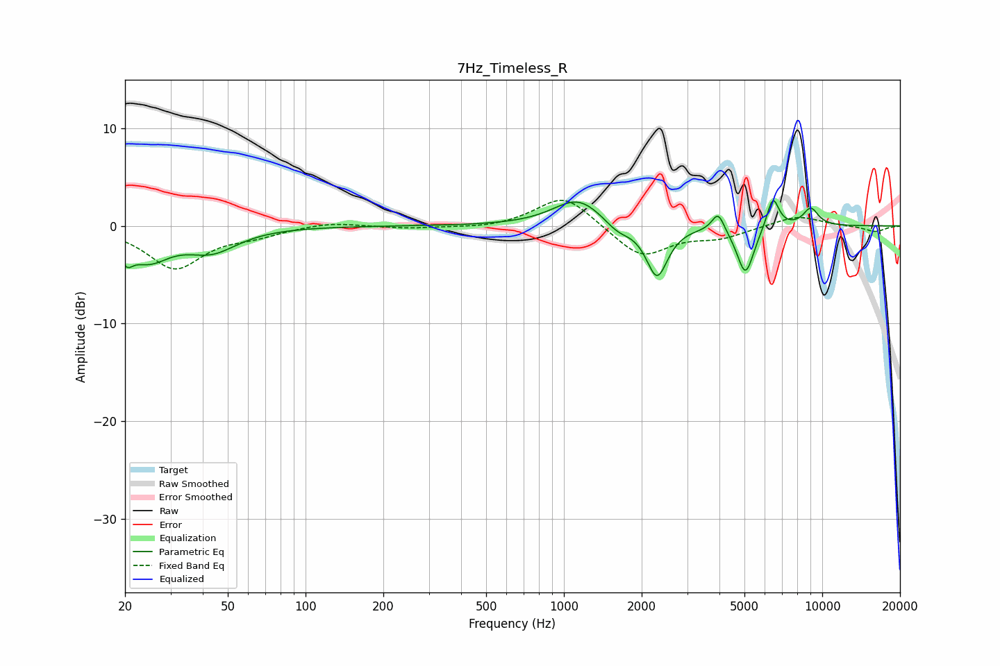

# 7Hz_Timeless_R
See [usage instructions](https://github.com/jaakkopasanen/AutoEq#usage) for more options and info.

### Parametric EQs
Apply preamp of -2.7 dB when using parametric equalizer.

|   # | Type    |   Fc (Hz) |    Q |   Gain (dB) |
|-----|---------|-----------|------|-------------|
|   1 | Peaking |        20 | 5.82 |        -1.7 |
|   2 | Peaking |        25 | 1.71 |        -3.1 |
|   3 | Peaking |        43 | 1.4  |        -2.3 |
|   4 | Peaking |      1135 | 1.48 |         2.8 |
|   5 | Peaking |      1615 | 2.75 |        -1.1 |
|   6 | Peaking |      2293 | 3.38 |        -5.3 |
|   7 | Peaking |      3953 | 5.9  |         2   |
|   8 | Peaking |      5046 | 4.21 |        -5   |
|   9 | Peaking |      6440 | 5.81 |         3.3 |
|  10 | Peaking |      9029 | 4.29 |         1.8 |

### Fixed Band EQs
When using fixed band (also called graphic) equalizer, apply preamp of **-2.7 dB** (if available) and set gains manually with these parameters.

|   # | Type    |   Fc (Hz) |    Q |   Gain (dB) |
|-----|---------|-----------|------|-------------|
|   1 | Peaking |        31 | 1.41 |        -4.3 |
|   2 | Peaking |        62 | 1.41 |        -0.8 |
|   3 | Peaking |       125 | 1.41 |         0.5 |
|   4 | Peaking |       250 | 1.41 |        -0.3 |
|   5 | Peaking |       500 | 1.41 |        -0.3 |
|   6 | Peaking |      1000 | 1.41 |         3.3 |
|   7 | Peaking |      2000 | 1.41 |        -3.3 |
|   8 | Peaking |      4000 | 1.41 |        -1.1 |
|   9 | Peaking |      8000 | 1.41 |         1.1 |
|  10 | Peaking |     16000 | 1.41 |        -0.6 |

### Graphs

