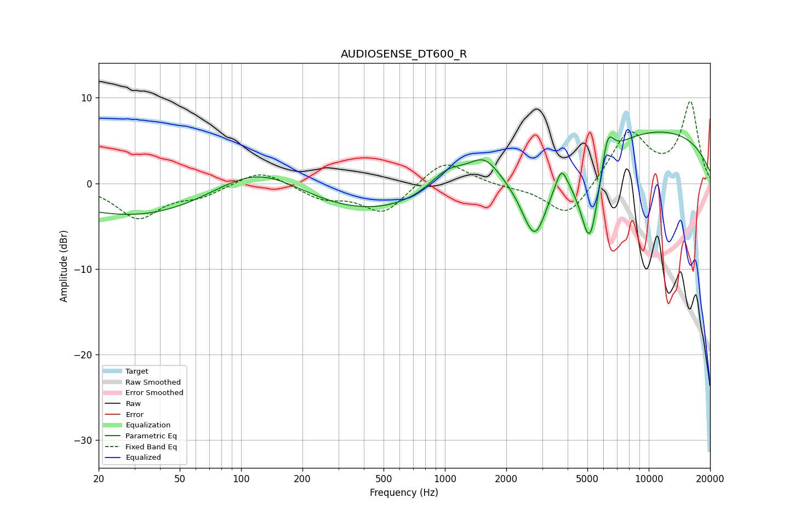

# AUDIOSENSE_DT600_R
See [usage instructions](https://github.com/jaakkopasanen/AutoEq#usage) for more options and info.

### Parametric EQs
Apply preamp of -6.1 dB when using parametric equalizer.

|   # | Type    |   Fc (Hz) |    Q |   Gain (dB) |
|-----|---------|-----------|------|-------------|
|   1 | Peaking |       117 | 0.18 |       -13.1 |
|   2 | Peaking |       120 | 0.37 |        13.8 |
|   3 | Peaking |      1028 | 1.52 |         2.5 |
|   4 | Peaking |      1557 | 1.94 |         2.5 |
|   5 | Peaking |      2538 | 1.21 |        -1.9 |
|   6 | Peaking |      2766 | 2.22 |        -7.6 |
|   7 | Peaking |      3729 | 5.46 |         2.3 |
|   8 | Peaking |      5143 | 2.57 |       -11.8 |
|   9 | Peaking |      6274 | 4.42 |         4.3 |
|  10 | Peaking |      8464 | 0.2  |         6.7 |

### Fixed Band EQs
When using fixed band (also called graphic) equalizer, apply preamp of **-9.7 dB** (if available) and set gains manually with these parameters.

|   # | Type    |   Fc (Hz) |    Q |   Gain (dB) |
|-----|---------|-----------|------|-------------|
|   1 | Peaking |        31 | 1.41 |        -4   |
|   2 | Peaking |        62 | 1.41 |        -1.3 |
|   3 | Peaking |       125 | 1.41 |         1.7 |
|   4 | Peaking |       250 | 1.41 |        -1.6 |
|   5 | Peaking |       500 | 1.41 |        -3.5 |
|   6 | Peaking |      1000 | 1.41 |         2.9 |
|   7 | Peaking |      2000 | 1.41 |        -0.3 |
|   8 | Peaking |      4000 | 1.41 |        -4.1 |
|   9 | Peaking |      8000 | 1.41 |         6.1 |
|  10 | Peaking |     16000 | 1.41 |         9.4 |

### Graphs

