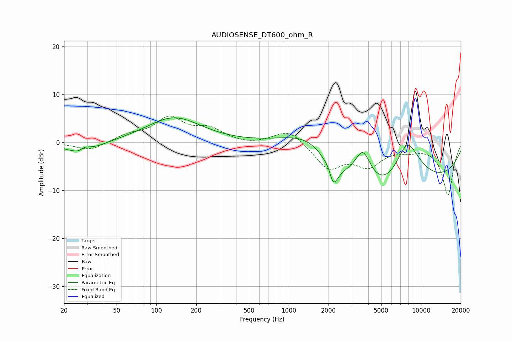

# AUDIOSENSE_DT600_ohm_R
See [usage instructions](https://github.com/jaakkopasanen/AutoEq#usage) for more options and info.

### Parametric EQs
Apply preamp of -5.3 dB when using parametric equalizer.

|   # | Type    |   Fc (Hz) |    Q |   Gain (dB) |
|-----|---------|-----------|------|-------------|
|   1 | Peaking |        26 | 4.26 |        -0.6 |
|   2 | Peaking |        28 | 1.34 |        -3.9 |
|   3 | Peaking |        28 | 2.26 |         2.7 |
|   4 | Peaking |       136 | 0.69 |         5.2 |
|   5 | Peaking |      1470 | 0.55 |         8.5 |
|   6 | Peaking |      2065 | 4.09 |         4.5 |
|   7 | Peaking |      2132 | 3.46 |        -9.5 |
|   8 | Peaking |      3642 | 2.25 |         7   |
|   9 | Peaking |      5886 | 0.27 |       -20   |
|  10 | Peaking |      7830 | 0.88 |        16.9 |

### Fixed Band EQs
When using fixed band (also called graphic) equalizer, apply preamp of **-5.6 dB** (if available) and set gains manually with these parameters.

|   # | Type    |   Fc (Hz) |    Q |   Gain (dB) |
|-----|---------|-----------|------|-------------|
|   1 | Peaking |        31 | 1.41 |        -1.7 |
|   2 | Peaking |        62 | 1.41 |         1.4 |
|   3 | Peaking |       125 | 1.41 |         4.9 |
|   4 | Peaking |       250 | 1.41 |         2.6 |
|   5 | Peaking |       500 | 1.41 |        -0.5 |
|   6 | Peaking |      1000 | 1.41 |         2.9 |
|   7 | Peaking |      2000 | 1.41 |        -5.2 |
|   8 | Peaking |      4000 | 1.41 |        -4.3 |
|   9 | Peaking |      8000 | 1.41 |        -1.1 |
|  10 | Peaking |     16000 | 1.41 |       -10.9 |

### Graphs

