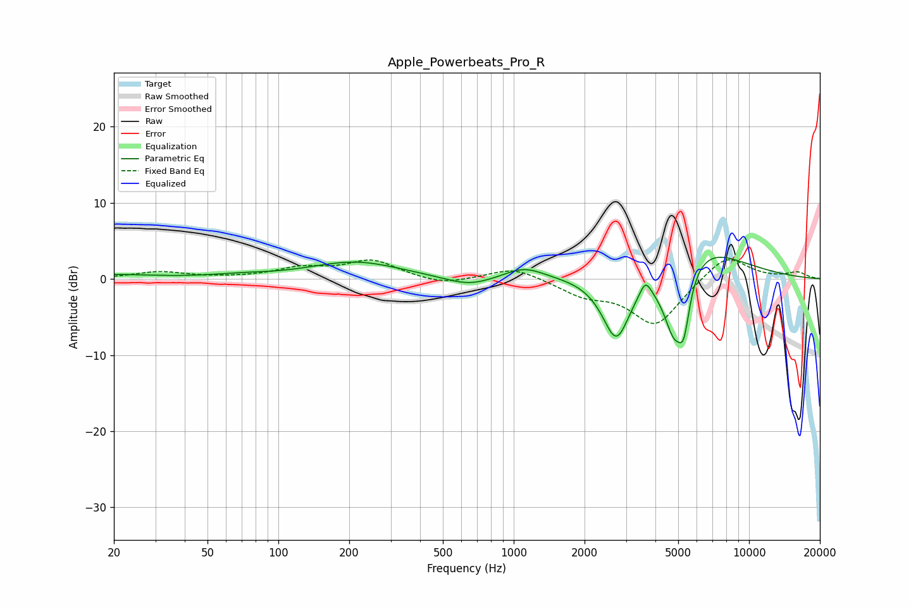

# Apple_Powerbeats_Pro_R
See [usage instructions](https://github.com/jaakkopasanen/AutoEq#usage) for more options and info.

### Parametric EQs
Apply preamp of -2.9 dB when using parametric equalizer.

|   # | Type    |   Fc (Hz) |    Q |   Gain (dB) |
|-----|---------|-----------|------|-------------|
|   1 | Peaking |        20 | 0.83 |         0.5 |
|   2 | Peaking |        68 | 1.18 |         0.3 |
|   3 | Peaking |       213 | 0.74 |         2.2 |
|   4 | Peaking |       646 | 1.39 |        -1.2 |
|   5 | Peaking |      1106 | 1.68 |         1.6 |
|   6 | Peaking |      2730 | 2.26 |        -9.1 |
|   7 | Peaking |      3628 | 6    |         2   |
|   8 | Peaking |      4812 | 2.43 |       -11.5 |
|   9 | Peaking |      5289 | 6    |        -5.1 |
|  10 | Peaking |      5482 | 0.78 |         6.9 |

### Fixed Band EQs
When using fixed band (also called graphic) equalizer, apply preamp of **-2.6 dB** (if available) and set gains manually with these parameters.

|   # | Type    |   Fc (Hz) |    Q |   Gain (dB) |
|-----|---------|-----------|------|-------------|
|   1 | Peaking |        31 | 1.41 |         0.9 |
|   2 | Peaking |        62 | 1.41 |         0.1 |
|   3 | Peaking |       125 | 1.41 |         1.3 |
|   4 | Peaking |       250 | 1.41 |         2.3 |
|   5 | Peaking |       500 | 1.41 |        -0.9 |
|   6 | Peaking |      1000 | 1.41 |         1.6 |
|   7 | Peaking |      2000 | 1.41 |        -1.9 |
|   8 | Peaking |      4000 | 1.41 |        -6.1 |
|   9 | Peaking |      8000 | 1.41 |         3.4 |
|  10 | Peaking |     16000 | 1.41 |         0.8 |

### Graphs

