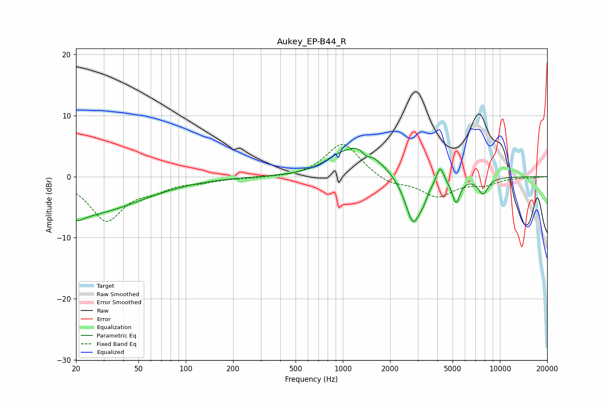

# Aukey_EP-B44_R
See [usage instructions](https://github.com/jaakkopasanen/AutoEq#usage) for more options and info.

### Parametric EQs
Apply preamp of -4.7 dB when using parametric equalizer.

|   # | Type    |   Fc (Hz) |    Q |   Gain (dB) |
|-----|---------|-----------|------|-------------|
|   1 | Peaking |        20 | 2.48 |        -1.6 |
|   2 | Peaking |        25 | 0.43 |        -5.8 |
|   3 | Peaking |       911 | 1.46 |         1.3 |
|   4 | Peaking |      1311 | 1.2  |         4.7 |
|   5 | Peaking |      1408 | 5.03 |        -1.1 |
|   6 | Peaking |      2804 | 2.71 |        -8.1 |
|   7 | Peaking |      3257 | 5.99 |        -1   |
|   8 | Peaking |      4155 | 5.99 |         2.9 |
|   9 | Peaking |      5259 | 5.54 |        -4   |
|  10 | Peaking |      7817 | 4.12 |        -2.7 |

### Fixed Band EQs
When using fixed band (also called graphic) equalizer, apply preamp of **-5.4 dB** (if available) and set gains manually with these parameters.

|   # | Type    |   Fc (Hz) |    Q |   Gain (dB) |
|-----|---------|-----------|------|-------------|
|   1 | Peaking |        31 | 1.41 |        -7   |
|   2 | Peaking |        62 | 1.41 |        -1.6 |
|   3 | Peaking |       125 | 1.41 |        -0.7 |
|   4 | Peaking |       250 | 1.41 |        -0.2 |
|   5 | Peaking |       500 | 1.41 |        -0.2 |
|   6 | Peaking |      1000 | 1.41 |         5.7 |
|   7 | Peaking |      2000 | 1.41 |        -1.3 |
|   8 | Peaking |      4000 | 1.41 |        -3.1 |
|   9 | Peaking |      8000 | 1.41 |        -1.1 |
|  10 | Peaking |     16000 | 1.41 |        -0.1 |

### Graphs

