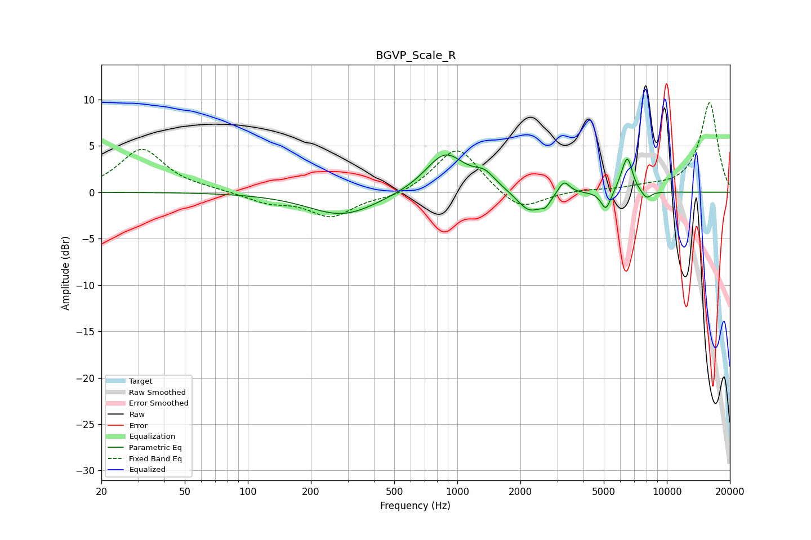

# BGVP_Scale_R
See [usage instructions](https://github.com/jaakkopasanen/AutoEq#usage) for more options and info.

### Parametric EQs
Apply preamp of -4.1 dB when using parametric equalizer.

|   # | Type    |   Fc (Hz) |    Q |   Gain (dB) |
|-----|---------|-----------|------|-------------|
|   1 | Peaking |       285 | 0.86 |        -2.5 |
|   2 | Peaking |       875 | 1.5  |         4.3 |
|   3 | Peaking |      1352 | 2.74 |         1.4 |
|   4 | Peaking |      2210 | 2.37 |        -2.3 |
|   5 | Peaking |      2636 | 5.9  |        -0.9 |
|   6 | Peaking |      3228 | 5.25 |         1.5 |
|   7 | Peaking |      5114 | 6    |        -2   |
|   8 | Peaking |      6159 | 5.99 |         0.9 |
|   9 | Peaking |      6516 | 5.93 |         3.3 |
|  10 | Peaking |      7993 | 5.52 |        -0.9 |

### Fixed Band EQs
When using fixed band (also called graphic) equalizer, apply preamp of **-9.7 dB** (if available) and set gains manually with these parameters.

|   # | Type    |   Fc (Hz) |    Q |   Gain (dB) |
|-----|---------|-----------|------|-------------|
|   1 | Peaking |        31 | 1.41 |         4.6 |
|   2 | Peaking |        62 | 1.41 |         0.2 |
|   3 | Peaking |       125 | 1.41 |        -1   |
|   4 | Peaking |       250 | 1.41 |        -2.6 |
|   5 | Peaking |       500 | 1.41 |        -0.6 |
|   6 | Peaking |      1000 | 1.41 |         5   |
|   7 | Peaking |      2000 | 1.41 |        -2.2 |
|   8 | Peaking |      4000 | 1.41 |         0.2 |
|   9 | Peaking |      8000 | 1.41 |         0.4 |
|  10 | Peaking |     16000 | 1.41 |         9.7 |

### Graphs

