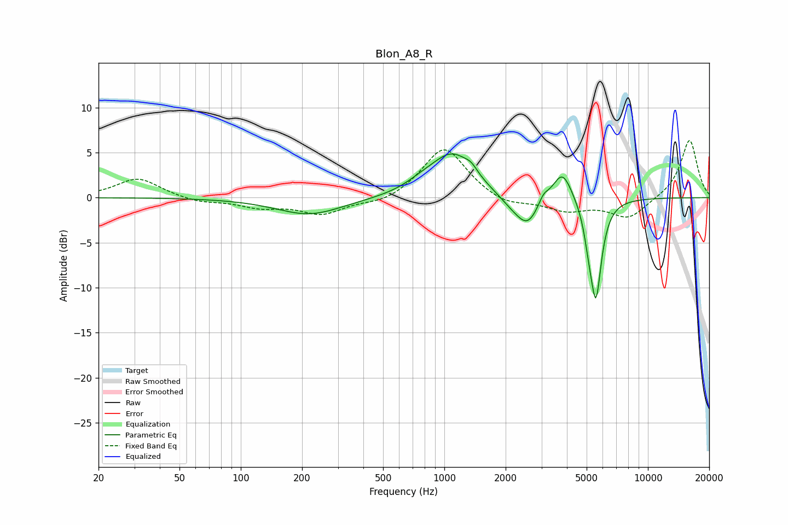

# Blon_A8_R
See [usage instructions](https://github.com/jaakkopasanen/AutoEq#usage) for more options and info.

### Parametric EQs
Apply preamp of -5.0 dB when using parametric equalizer.

|   # | Type    |   Fc (Hz) |    Q |   Gain (dB) |
|-----|---------|-----------|------|-------------|
|   1 | Peaking |       217 | 0.87 |        -1.9 |
|   2 | Peaking |       776 | 1.67 |         0.8 |
|   3 | Peaking |      1097 | 1.35 |         4.7 |
|   4 | Peaking |      1357 | 4.57 |         0.7 |
|   5 | Peaking |      2122 | 2.16 |        -0.9 |
|   6 | Peaking |      2561 | 2.48 |        -3.1 |
|   7 | Peaking |      3069 | 6    |         0.9 |
|   8 | Peaking |      3802 | 2.97 |         3.4 |
|   9 | Peaking |      5134 | 6    |        -2.2 |
|  10 | Peaking |      5557 | 4.99 |       -10.5 |

### Fixed Band EQs
When using fixed band (also called graphic) equalizer, apply preamp of **-6.4 dB** (if available) and set gains manually with these parameters.

|   # | Type    |   Fc (Hz) |    Q |   Gain (dB) |
|-----|---------|-----------|------|-------------|
|   1 | Peaking |        31 | 1.41 |         2.2 |
|   2 | Peaking |        62 | 1.41 |        -0.5 |
|   3 | Peaking |       125 | 1.41 |        -1   |
|   4 | Peaking |       250 | 1.41 |        -1.8 |
|   5 | Peaking |       500 | 1.41 |        -0.7 |
|   6 | Peaking |      1000 | 1.41 |         5.7 |
|   7 | Peaking |      2000 | 1.41 |        -1   |
|   8 | Peaking |      4000 | 1.41 |        -1.4 |
|   9 | Peaking |      8000 | 1.41 |        -2.3 |
|  10 | Peaking |     16000 | 1.41 |         6.5 |

### Graphs

