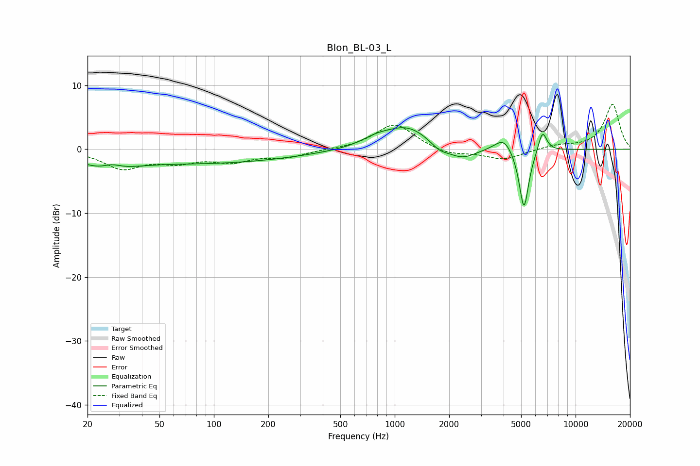

# Blon_BL-03_L
See [usage instructions](https://github.com/jaakkopasanen/AutoEq#usage) for more options and info.

### Parametric EQs
Apply preamp of -3.5 dB when using parametric equalizer.

|   # | Type    |   Fc (Hz) |    Q |   Gain (dB) |
|-----|---------|-----------|------|-------------|
|   1 | Peaking |        25 | 1.07 |        -2.4 |
|   2 | Peaking |        27 | 2.53 |         1.1 |
|   3 | Peaking |        93 | 0.29 |        -2.1 |
|   4 | Peaking |       784 | 1.7  |         1   |
|   5 | Peaking |      1172 | 1.11 |         3.5 |
|   6 | Peaking |      1765 | 2.91 |        -1.1 |
|   7 | Peaking |      2345 | 1.79 |        -1.9 |
|   8 | Peaking |      4009 | 2.83 |         2.2 |
|   9 | Peaking |      5183 | 5.16 |        -9.8 |
|  10 | Peaking |      6561 | 5.65 |         3.4 |

### Fixed Band EQs
When using fixed band (also called graphic) equalizer, apply preamp of **-7.1 dB** (if available) and set gains manually with these parameters.

|   # | Type    |   Fc (Hz) |    Q |   Gain (dB) |
|-----|---------|-----------|------|-------------|
|   1 | Peaking |        31 | 1.41 |        -2.8 |
|   2 | Peaking |        62 | 1.41 |        -1.7 |
|   3 | Peaking |       125 | 1.41 |        -1.7 |
|   4 | Peaking |       250 | 1.41 |        -1.1 |
|   5 | Peaking |       500 | 1.41 |        -0   |
|   6 | Peaking |      1000 | 1.41 |         4   |
|   7 | Peaking |      2000 | 1.41 |        -0.9 |
|   8 | Peaking |      4000 | 1.41 |        -1.6 |
|   9 | Peaking |      8000 | 1.41 |         0.6 |
|  10 | Peaking |     16000 | 1.41 |         7.1 |

### Graphs

