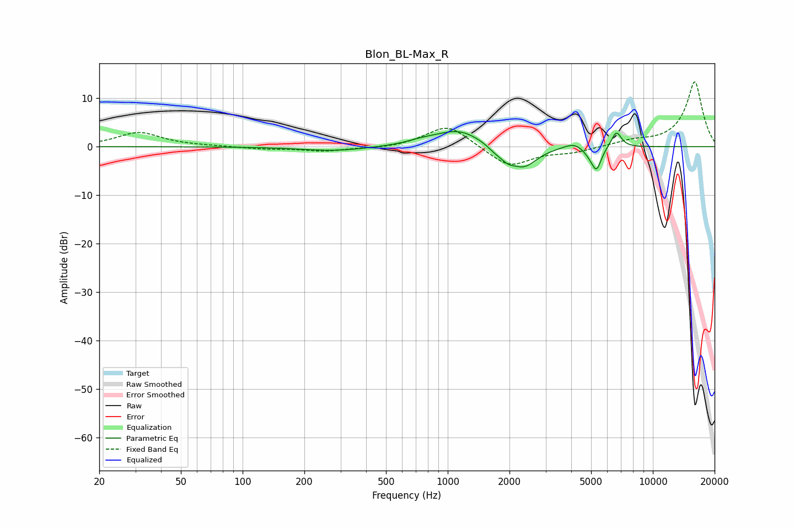

# Blon_BL-Max_R
See [usage instructions](https://github.com/jaakkopasanen/AutoEq#usage) for more options and info.

### Parametric EQs
Apply preamp of -3.2 dB when using parametric equalizer.

|   # | Type    |   Fc (Hz) |    Q |   Gain (dB) |
|-----|---------|-----------|------|-------------|
|   1 | Peaking |       282 | 0.87 |        -0.9 |
|   2 | Peaking |       755 | 1.86 |         0.7 |
|   3 | Peaking |      1137 | 1.25 |         3.5 |
|   4 | Peaking |      1721 | 3.31 |        -1.2 |
|   5 | Peaking |      1966 | 4.23 |        -1.4 |
|   6 | Peaking |      2346 | 2.13 |        -4.3 |
|   7 | Peaking |      4162 | 2.71 |         1.3 |
|   8 | Peaking |      4890 | 4.27 |        -1.2 |
|   9 | Peaking |      5313 | 6    |        -4.5 |
|  10 | Peaking |      6641 | 5.69 |         3.3 |

### Fixed Band EQs
When using fixed band (also called graphic) equalizer, apply preamp of **-13.5 dB** (if available) and set gains manually with these parameters.

|   # | Type    |   Fc (Hz) |    Q |   Gain (dB) |
|-----|---------|-----------|------|-------------|
|   1 | Peaking |        31 | 1.41 |         2.9 |
|   2 | Peaking |        62 | 1.41 |         0.1 |
|   3 | Peaking |       125 | 1.41 |        -0.4 |
|   4 | Peaking |       250 | 1.41 |        -0.9 |
|   5 | Peaking |       500 | 1.41 |        -0.4 |
|   6 | Peaking |      1000 | 1.41 |         4.7 |
|   7 | Peaking |      2000 | 1.41 |        -4.3 |
|   8 | Peaking |      4000 | 1.41 |        -1.1 |
|   9 | Peaking |      8000 | 1.41 |         1   |
|  10 | Peaking |     16000 | 1.41 |        13.4 |

### Graphs

