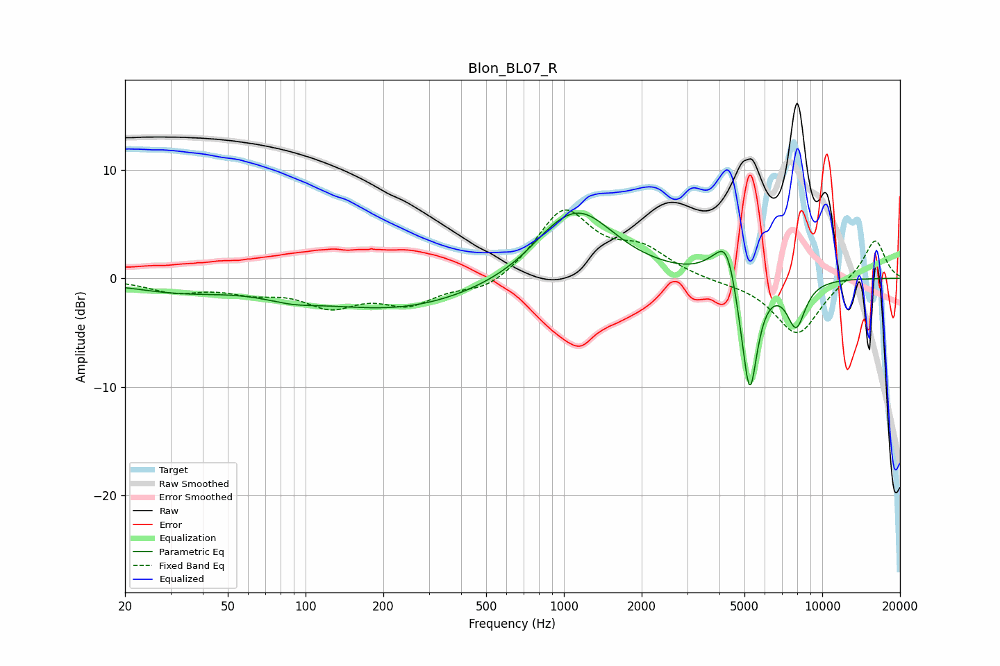

# Blon_BL07_R
See [usage instructions](https://github.com/jaakkopasanen/AutoEq#usage) for more options and info.

### Parametric EQs
Apply preamp of -6.1 dB when using parametric equalizer.

|   # | Type    |   Fc (Hz) |    Q |   Gain (dB) |
|-----|---------|-----------|------|-------------|
|   1 | Peaking |        32 | 0.69 |        -1.1 |
|   2 | Peaking |        89 | 1.35 |        -0.7 |
|   3 | Peaking |       229 | 0.43 |        -2.8 |
|   4 | Peaking |       886 | 1.49 |         0.9 |
|   5 | Peaking |      1150 | 0.99 |         6   |
|   6 | Peaking |      3848 | 2.43 |         0.9 |
|   7 | Peaking |      4288 | 3.54 |         3.7 |
|   8 | Peaking |      4972 | 3.54 |        -1.8 |
|   9 | Peaking |      5249 | 4.62 |        -9.7 |
|  10 | Peaking |      7923 | 3.6  |        -4.2 |

### Fixed Band EQs
When using fixed band (also called graphic) equalizer, apply preamp of **-6.4 dB** (if available) and set gains manually with these parameters.

|   # | Type    |   Fc (Hz) |    Q |   Gain (dB) |
|-----|---------|-----------|------|-------------|
|   1 | Peaking |        31 | 1.41 |        -1.1 |
|   2 | Peaking |        62 | 1.41 |        -1   |
|   3 | Peaking |       125 | 1.41 |        -2.3 |
|   4 | Peaking |       250 | 1.41 |        -2.2 |
|   5 | Peaking |       500 | 1.41 |        -1.3 |
|   6 | Peaking |      1000 | 1.41 |         6.2 |
|   7 | Peaking |      2000 | 1.41 |         2.3 |
|   8 | Peaking |      4000 | 1.41 |        -0.3 |
|   9 | Peaking |      8000 | 1.41 |        -5.2 |
|  10 | Peaking |     16000 | 1.41 |         3.7 |

### Graphs

