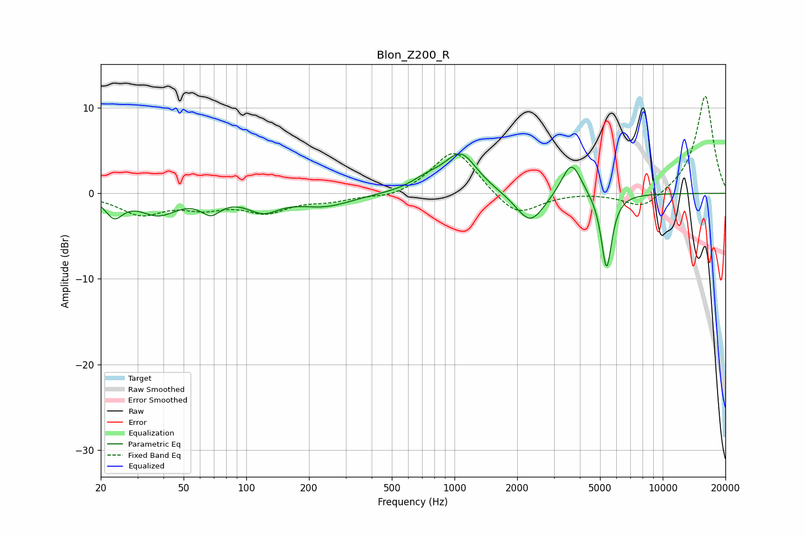

# Blon_Z200_R
See [usage instructions](https://github.com/jaakkopasanen/AutoEq#usage) for more options and info.

### Parametric EQs
Apply preamp of -4.7 dB when using parametric equalizer.

|   # | Type    |   Fc (Hz) |    Q |   Gain (dB) |
|-----|---------|-----------|------|-------------|
|   1 | Peaking |        23 | 3.46 |        -2.3 |
|   2 | Peaking |        38 | 1.61 |        -2.3 |
|   3 | Peaking |        68 | 3.12 |        -1.8 |
|   4 | Peaking |       121 | 1.89 |        -1.8 |
|   5 | Peaking |       240 | 1.1  |        -1.4 |
|   6 | Peaking |       738 | 1.81 |         1.1 |
|   7 | Peaking |      1072 | 1.79 |         4.5 |
|   8 | Peaking |      2309 | 2.07 |        -3.7 |
|   9 | Peaking |      3644 | 2.98 |         4.1 |
|  10 | Peaking |      5374 | 5.42 |        -9   |

### Fixed Band EQs
When using fixed band (also called graphic) equalizer, apply preamp of **-11.4 dB** (if available) and set gains manually with these parameters.

|   # | Type    |   Fc (Hz) |    Q |   Gain (dB) |
|-----|---------|-----------|------|-------------|
|   1 | Peaking |        31 | 1.41 |        -2.3 |
|   2 | Peaking |        62 | 1.41 |        -1.4 |
|   3 | Peaking |       125 | 1.41 |        -2   |
|   4 | Peaking |       250 | 1.41 |        -0.7 |
|   5 | Peaking |       500 | 1.41 |        -0.6 |
|   6 | Peaking |      1000 | 1.41 |         5.3 |
|   7 | Peaking |      2000 | 1.41 |        -2.9 |
|   8 | Peaking |      4000 | 1.41 |         0.1 |
|   9 | Peaking |      8000 | 1.41 |        -2   |
|  10 | Peaking |     16000 | 1.41 |        11.5 |

### Graphs

