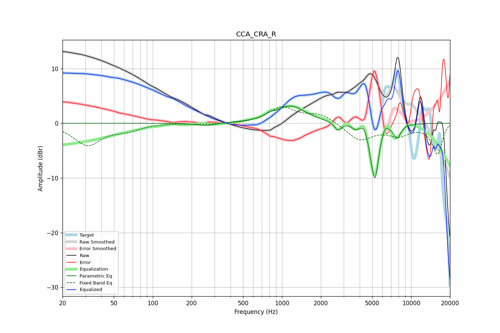

# CCA_CRA_R
See [usage instructions](https://github.com/jaakkopasanen/AutoEq#usage) for more options and info.

### Parametric EQs
Apply preamp of -3.2 dB when using parametric equalizer.

|   # | Type    |   Fc (Hz) |    Q |   Gain (dB) |
|-----|---------|-----------|------|-------------|
|   1 | Peaking |       257 | 1.95 |        -0.5 |
|   2 | Peaking |       804 | 5.14 |         0.5 |
|   3 | Peaking |      1159 | 1.23 |         3.2 |
|   4 | Peaking |      2707 | 5.46 |        -1.5 |
|   5 | Peaking |      3710 | 6    |        -0.7 |
|   6 | Peaking |      4313 | 6    |         1.1 |
|   7 | Peaking |      4897 | 6    |        -1.5 |
|   8 | Peaking |      5264 | 4.95 |        -9.5 |
|   9 | Peaking |      6297 | 6    |         1.4 |
|  10 | Peaking |      7805 | 4.94 |        -2.4 |

### Fixed Band EQs
When using fixed band (also called graphic) equalizer, apply preamp of **-3.1 dB** (if available) and set gains manually with these parameters.

|   # | Type    |   Fc (Hz) |    Q |   Gain (dB) |
|-----|---------|-----------|------|-------------|
|   1 | Peaking |        31 | 1.41 |        -3.9 |
|   2 | Peaking |        62 | 1.41 |        -1.1 |
|   3 | Peaking |       125 | 1.41 |         0.1 |
|   4 | Peaking |       250 | 1.41 |        -0.2 |
|   5 | Peaking |       500 | 1.41 |        -0.1 |
|   6 | Peaking |      1000 | 1.41 |         2.9 |
|   7 | Peaking |      2000 | 1.41 |         1.6 |
|   8 | Peaking |      4000 | 1.41 |        -3.1 |
|   9 | Peaking |      8000 | 1.41 |        -1.9 |
|  10 | Peaking |     16000 | 1.41 |        -5.6 |

### Graphs

