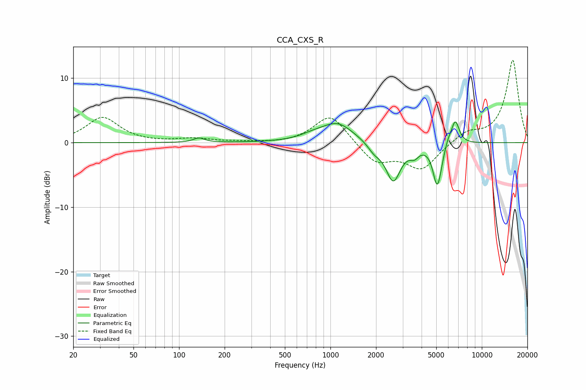

# CCA_CXS_R
See [usage instructions](https://github.com/jaakkopasanen/AutoEq#usage) for more options and info.

### Parametric EQs
Apply preamp of -3.3 dB when using parametric equalizer.

|   # | Type    |   Fc (Hz) |    Q |   Gain (dB) |
|-----|---------|-----------|------|-------------|
|   1 | Peaking |       135 | 4    |         0.7 |
|   2 | Peaking |       763 | 1.71 |         0.6 |
|   3 | Peaking |      1114 | 1.34 |         3   |
|   4 | Peaking |      1943 | 3.3  |        -1.2 |
|   5 | Peaking |      2599 | 2.88 |        -5.9 |
|   6 | Peaking |      3581 | 4.83 |        -1.2 |
|   7 | Peaking |      5056 | 5.02 |        -5.9 |
|   8 | Peaking |      5287 | 6    |        -1   |
|   9 | Peaking |      5990 | 6    |         1   |
|  10 | Peaking |      6680 | 5.19 |         3.7 |

### Fixed Band EQs
When using fixed band (also called graphic) equalizer, apply preamp of **-12.9 dB** (if available) and set gains manually with these parameters.

|   # | Type    |   Fc (Hz) |    Q |   Gain (dB) |
|-----|---------|-----------|------|-------------|
|   1 | Peaking |        31 | 1.41 |         3.9 |
|   2 | Peaking |        62 | 1.41 |        -0   |
|   3 | Peaking |       125 | 1.41 |         0.6 |
|   4 | Peaking |       250 | 1.41 |         0.1 |
|   5 | Peaking |       500 | 1.41 |        -0.2 |
|   6 | Peaking |      1000 | 1.41 |         4.5 |
|   7 | Peaking |      2000 | 1.41 |        -3.1 |
|   8 | Peaking |      4000 | 1.41 |        -4   |
|   9 | Peaking |      8000 | 1.41 |         1.6 |
|  10 | Peaking |     16000 | 1.41 |        12.8 |

### Graphs

