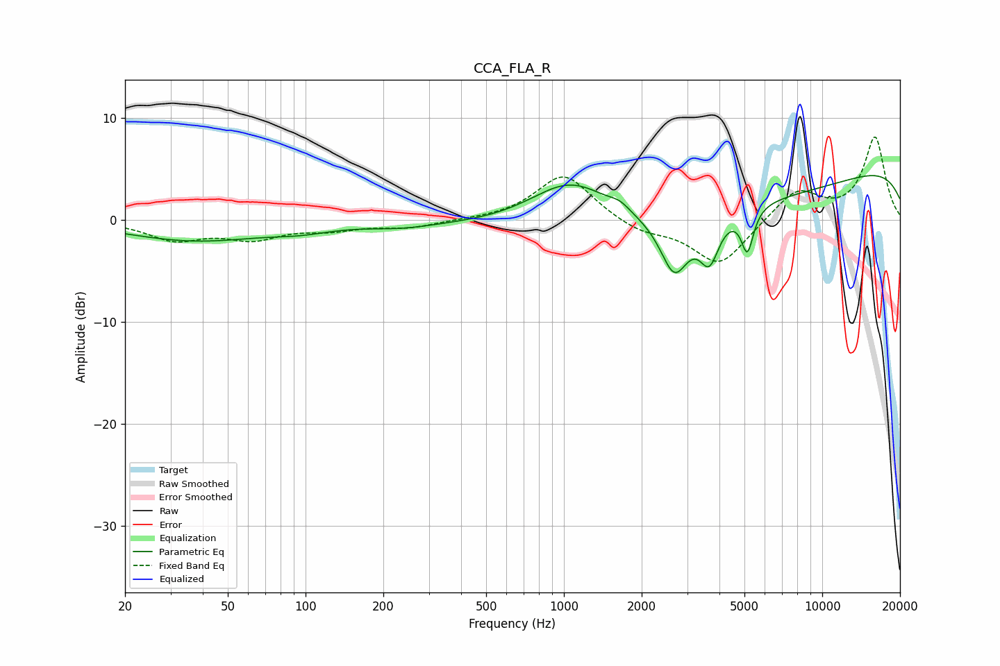

# CCA_FLA_R
See [usage instructions](https://github.com/jaakkopasanen/AutoEq#usage) for more options and info.

### Parametric EQs
Apply preamp of -4.5 dB when using parametric equalizer.

|   # | Type    |   Fc (Hz) |    Q |   Gain (dB) |
|-----|---------|-----------|------|-------------|
|   1 | Peaking |        37 | 0.53 |        -2   |
|   2 | Peaking |        96 | 1.22 |        -0.6 |
|   3 | Peaking |       235 | 1.08 |        -0.5 |
|   4 | Peaking |      1064 | 0.82 |         5.6 |
|   5 | Peaking |      1650 | 3.62 |         0.6 |
|   6 | Peaking |      2678 | 2.58 |        -5.6 |
|   7 | Peaking |      3449 | 0.19 |        -4.3 |
|   8 | Peaking |      3657 | 3.74 |        -4.2 |
|   9 | Peaking |      5132 | 6    |        -4.2 |
|  10 | Peaking |     10000 | 0.18 |         6.5 |

### Fixed Band EQs
When using fixed band (also called graphic) equalizer, apply preamp of **-8.2 dB** (if available) and set gains manually with these parameters.

|   # | Type    |   Fc (Hz) |    Q |   Gain (dB) |
|-----|---------|-----------|------|-------------|
|   1 | Peaking |        31 | 1.41 |        -1.8 |
|   2 | Peaking |        62 | 1.41 |        -1.6 |
|   3 | Peaking |       125 | 1.41 |        -0.8 |
|   4 | Peaking |       250 | 1.41 |        -0.7 |
|   5 | Peaking |       500 | 1.41 |        -0   |
|   6 | Peaking |      1000 | 1.41 |         4.6 |
|   7 | Peaking |      2000 | 1.41 |        -1.2 |
|   8 | Peaking |      4000 | 1.41 |        -4.5 |
|   9 | Peaking |      8000 | 1.41 |         3   |
|  10 | Peaking |     16000 | 1.41 |         8.1 |

### Graphs

