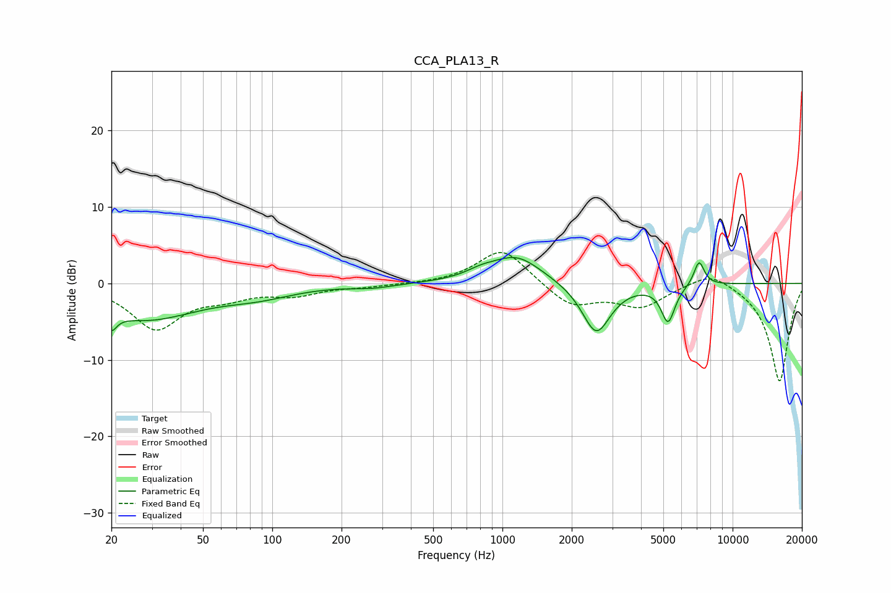

# CCA_PLA13_R
See [usage instructions](https://github.com/jaakkopasanen/AutoEq#usage) for more options and info.

### Parametric EQs
Apply preamp of -3.5 dB when using parametric equalizer.

|   # | Type    |   Fc (Hz) |    Q |   Gain (dB) |
|-----|---------|-----------|------|-------------|
|   1 | Peaking |        20 | 5.94 |        -5.5 |
|   2 | Peaking |        20 | 5.98 |         3.2 |
|   3 | Peaking |        28 | 0.62 |        -4.5 |
|   4 | Peaking |        87 | 0.88 |        -1.3 |
|   5 | Peaking |       274 | 1.54 |        -0.5 |
|   6 | Peaking |       807 | 2.12 |         0.8 |
|   7 | Peaking |      1153 | 1.29 |         3.5 |
|   8 | Peaking |      2557 | 2.27 |        -6.7 |
|   9 | Peaking |      5242 | 4.66 |        -4.8 |
|  10 | Peaking |      7151 | 5.91 |         3.2 |

### Fixed Band EQs
When using fixed band (also called graphic) equalizer, apply preamp of **-4.1 dB** (if available) and set gains manually with these parameters.

|   # | Type    |   Fc (Hz) |    Q |   Gain (dB) |
|-----|---------|-----------|------|-------------|
|   1 | Peaking |        31 | 1.41 |        -5.8 |
|   2 | Peaking |        62 | 1.41 |        -1.4 |
|   3 | Peaking |       125 | 1.41 |        -1.3 |
|   4 | Peaking |       250 | 1.41 |        -0.4 |
|   5 | Peaking |       500 | 1.41 |        -0.1 |
|   6 | Peaking |      1000 | 1.41 |         4.7 |
|   7 | Peaking |      2000 | 1.41 |        -3   |
|   8 | Peaking |      4000 | 1.41 |        -2.9 |
|   9 | Peaking |      8000 | 1.41 |         1.9 |
|  10 | Peaking |     16000 | 1.41 |       -12.9 |

### Graphs

