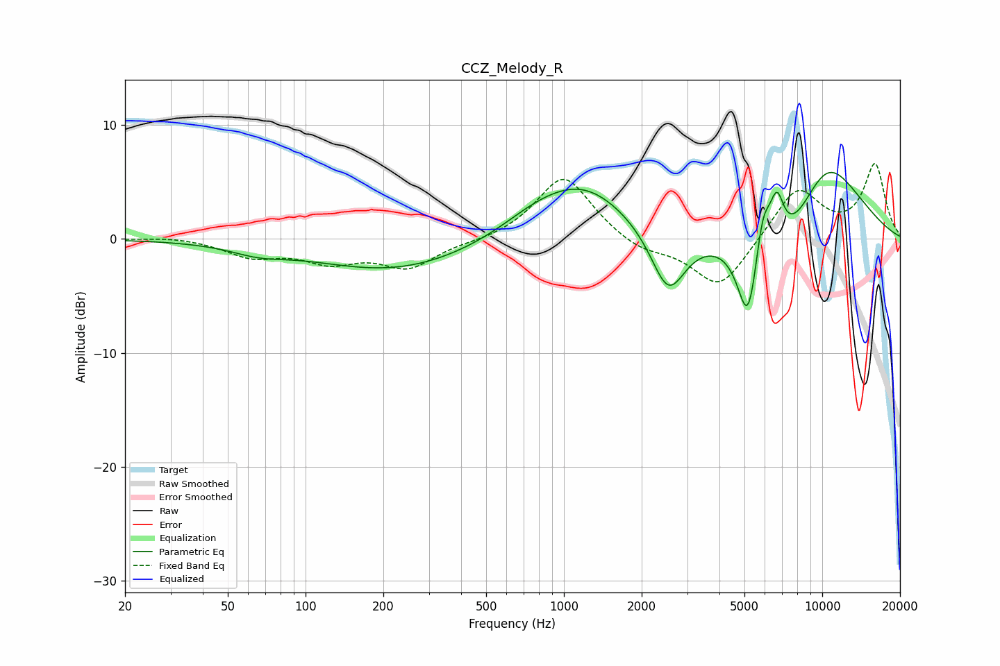

# CCZ_Melody_R
See [usage instructions](https://github.com/jaakkopasanen/AutoEq#usage) for more options and info.

### Parametric EQs
Apply preamp of -5.9 dB when using parametric equalizer.

|   # | Type    |   Fc (Hz) |    Q |   Gain (dB) |
|-----|---------|-----------|------|-------------|
|   1 | Peaking |        66 | 1.33 |        -0.7 |
|   2 | Peaking |       221 | 0.45 |        -2.8 |
|   3 | Peaking |       762 | 1.06 |         1   |
|   4 | Peaking |      1180 | 0.76 |         4.7 |
|   5 | Peaking |      2535 | 2.07 |        -5.7 |
|   6 | Peaking |      5169 | 3.39 |        -7.7 |
|   7 | Peaking |      5882 | 4.55 |         4.2 |
|   8 | Peaking |      6675 | 4.95 |         3.9 |
|   9 | Peaking |      7693 | 0.88 |        -5.6 |
|  10 | Peaking |     10000 | 0.78 |         9.5 |

### Fixed Band EQs
When using fixed band (also called graphic) equalizer, apply preamp of **-6.7 dB** (if available) and set gains manually with these parameters.

|   # | Type    |   Fc (Hz) |    Q |   Gain (dB) |
|-----|---------|-----------|------|-------------|
|   1 | Peaking |        31 | 1.41 |         0.2 |
|   2 | Peaking |        62 | 1.41 |        -1.4 |
|   3 | Peaking |       125 | 1.41 |        -1.8 |
|   4 | Peaking |       250 | 1.41 |        -2.4 |
|   5 | Peaking |       500 | 1.41 |        -0.2 |
|   6 | Peaking |      1000 | 1.41 |         5.7 |
|   7 | Peaking |      2000 | 1.41 |        -1.1 |
|   8 | Peaking |      4000 | 1.41 |        -4.5 |
|   9 | Peaking |      8000 | 1.41 |         4.5 |
|  10 | Peaking |     16000 | 1.41 |         6.5 |

### Graphs

