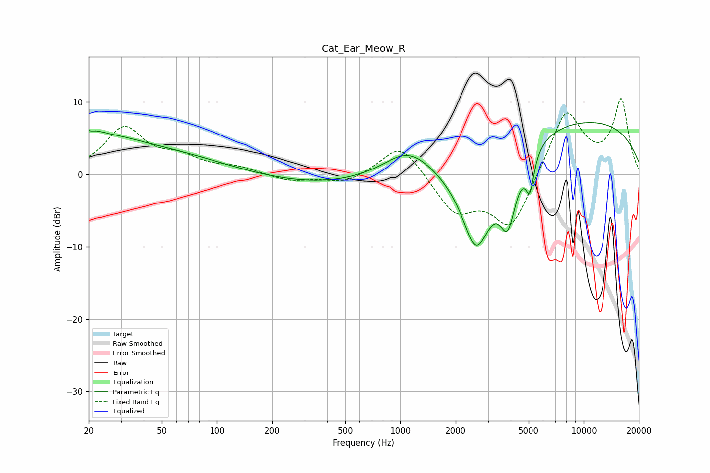

# Cat_Ear_Meow_R
See [usage instructions](https://github.com/jaakkopasanen/AutoEq#usage) for more options and info.

### Parametric EQs
Apply preamp of -7.3 dB when using parametric equalizer.

|   # | Type    |   Fc (Hz) |    Q |   Gain (dB) |
|-----|---------|-----------|------|-------------|
|   1 | Peaking |        20 | 4.68 |         3.2 |
|   2 | Peaking |        20 | 5.71 |        -2.7 |
|   3 | Peaking |        20 | 0.48 |         5.2 |
|   4 | Peaking |        69 | 0.55 |         1.5 |
|   5 | Peaking |       410 | 0.43 |        -1.6 |
|   6 | Peaking |      1093 | 1.17 |         3   |
|   7 | Peaking |      2591 | 1.4  |       -15   |
|   8 | Peaking |      3864 | 3.02 |        -8.3 |
|   9 | Peaking |      5082 | 6    |        -5   |
|  10 | Peaking |      7595 | 0.18 |         8   |

### Fixed Band EQs
When using fixed band (also called graphic) equalizer, apply preamp of **-10.6 dB** (if available) and set gains manually with these parameters.

|   # | Type    |   Fc (Hz) |    Q |   Gain (dB) |
|-----|---------|-----------|------|-------------|
|   1 | Peaking |        31 | 1.41 |         6.2 |
|   2 | Peaking |        62 | 1.41 |         1.9 |
|   3 | Peaking |       125 | 1.41 |         0.9 |
|   4 | Peaking |       250 | 1.41 |        -0.9 |
|   5 | Peaking |       500 | 1.41 |        -1.3 |
|   6 | Peaking |      1000 | 1.41 |         4.5 |
|   7 | Peaking |      2000 | 1.41 |        -5.1 |
|   8 | Peaking |      4000 | 1.41 |        -7.6 |
|   9 | Peaking |      8000 | 1.41 |         9.1 |
|  10 | Peaking |     16000 | 1.41 |        10.1 |

### Graphs

