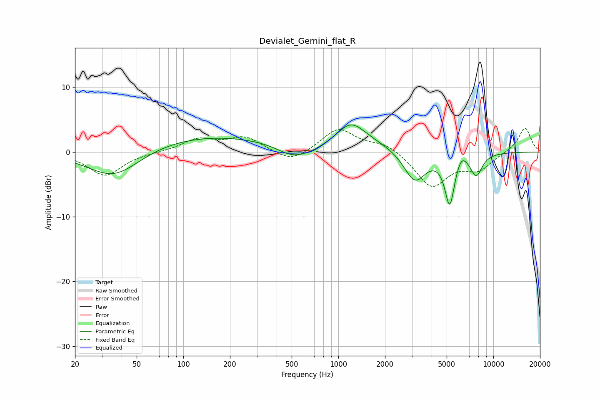

# Devialet_Gemini_flat_R
See [usage instructions](https://github.com/jaakkopasanen/AutoEq#usage) for more options and info.

### Parametric EQs
Apply preamp of -4.3 dB when using parametric equalizer.

|   # | Type    |   Fc (Hz) |    Q |   Gain (dB) |
|-----|---------|-----------|------|-------------|
|   1 | Peaking |        36 | 0.83 |        -4.5 |
|   2 | Peaking |       138 | 0.31 |         2.6 |
|   3 | Peaking |       505 | 1.42 |        -1.7 |
|   4 | Peaking |       659 | 1.36 |        -0.6 |
|   5 | Peaking |      1205 | 1.47 |         4   |
|   6 | Peaking |      1851 | 0.95 |         0.8 |
|   7 | Peaking |      3112 | 2    |        -4.7 |
|   8 | Peaking |      5234 | 4.36 |        -7.8 |
|   9 | Peaking |      6214 | 3.82 |         1.6 |
|  10 | Peaking |      7755 | 3.46 |        -3.4 |

### Fixed Band EQs
When using fixed band (also called graphic) equalizer, apply preamp of **-3.8 dB** (if available) and set gains manually with these parameters.

|   # | Type    |   Fc (Hz) |    Q |   Gain (dB) |
|-----|---------|-----------|------|-------------|
|   1 | Peaking |        31 | 1.41 |        -3.7 |
|   2 | Peaking |        62 | 1.41 |        -0.1 |
|   3 | Peaking |       125 | 1.41 |         1.9 |
|   4 | Peaking |       250 | 1.41 |         2.2 |
|   5 | Peaking |       500 | 1.41 |        -1.8 |
|   6 | Peaking |      1000 | 1.41 |         3.6 |
|   7 | Peaking |      2000 | 1.41 |         1.4 |
|   8 | Peaking |      4000 | 1.41 |        -5.3 |
|   9 | Peaking |      8000 | 1.41 |        -2.5 |
|  10 | Peaking |     16000 | 1.41 |         3.8 |

### Graphs

