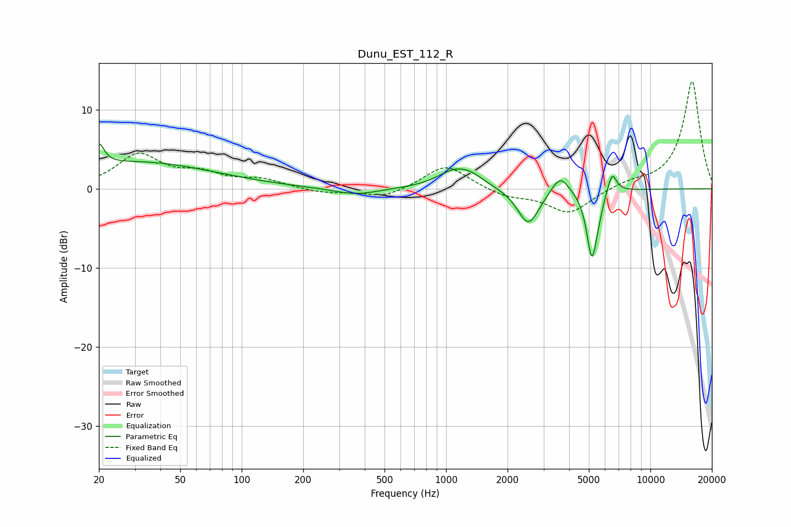

# Dunu_EST_112_R
See [usage instructions](https://github.com/jaakkopasanen/AutoEq#usage) for more options and info.

### Parametric EQs
Apply preamp of -5.8 dB when using parametric equalizer.

|   # | Type    |   Fc (Hz) |    Q |   Gain (dB) |
|-----|---------|-----------|------|-------------|
|   1 | Peaking |        20 | 5.66 |         2.7 |
|   2 | Peaking |        31 | 0.37 |         3.4 |
|   3 | Peaking |       361 | 1.27 |        -0.9 |
|   4 | Peaking |      1127 | 1.57 |         2.4 |
|   5 | Peaking |      1365 | 2.43 |         0.6 |
|   6 | Peaking |      2530 | 2.66 |        -4.7 |
|   7 | Peaking |      3617 | 3.38 |         2.3 |
|   8 | Peaking |      5163 | 5.5  |        -8.1 |
|   9 | Peaking |      5510 | 5.36 |        -1.3 |
|  10 | Peaking |      6486 | 5.86 |         2.8 |

### Fixed Band EQs
When using fixed band (also called graphic) equalizer, apply preamp of **-13.7 dB** (if available) and set gains manually with these parameters.

|   # | Type    |   Fc (Hz) |    Q |   Gain (dB) |
|-----|---------|-----------|------|-------------|
|   1 | Peaking |        31 | 1.41 |         4.2 |
|   2 | Peaking |        62 | 1.41 |         1.6 |
|   3 | Peaking |       125 | 1.41 |         1.1 |
|   4 | Peaking |       250 | 1.41 |        -0.6 |
|   5 | Peaking |       500 | 1.41 |        -1.2 |
|   6 | Peaking |      1000 | 1.41 |         3.1 |
|   7 | Peaking |      2000 | 1.41 |        -1   |
|   8 | Peaking |      4000 | 1.41 |        -3.1 |
|   9 | Peaking |      8000 | 1.41 |         0.7 |
|  10 | Peaking |     16000 | 1.41 |        13.7 |

### Graphs

