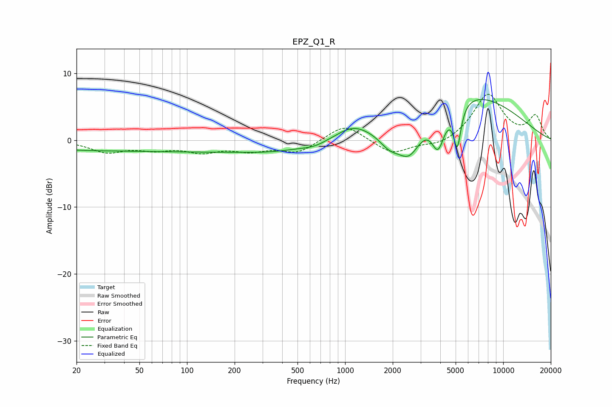

# EPZ_Q1_R
See [usage instructions](https://github.com/jaakkopasanen/AutoEq#usage) for more options and info.

### Parametric EQs
Apply preamp of -6.2 dB when using parametric equalizer.

|   # | Type    |   Fc (Hz) |    Q |   Gain (dB) |
|-----|---------|-----------|------|-------------|
|   1 | Peaking |        31 | 0.22 |        -1.5 |
|   2 | Peaking |       121 | 0.64 |        -0.3 |
|   3 | Peaking |       342 | 0.54 |        -1.5 |
|   4 | Peaking |       640 | 1.86 |        -0.5 |
|   5 | Peaking |      1118 | 1.35 |         1.9 |
|   6 | Peaking |      1913 | 2.1  |        -2.3 |
|   7 | Peaking |      2546 | 1.85 |        -5   |
|   8 | Peaking |      3877 | 3.4  |        -5.4 |
|   9 | Peaking |      5124 | 6    |        -6.2 |
|  10 | Peaking |      5959 | 0.41 |         7   |

### Fixed Band EQs
When using fixed band (also called graphic) equalizer, apply preamp of **-7.0 dB** (if available) and set gains manually with these parameters.

|   # | Type    |   Fc (Hz) |    Q |   Gain (dB) |
|-----|---------|-----------|------|-------------|
|   1 | Peaking |        31 | 1.41 |        -1.7 |
|   2 | Peaking |        62 | 1.41 |        -1.1 |
|   3 | Peaking |       125 | 1.41 |        -1.5 |
|   4 | Peaking |       250 | 1.41 |        -1.3 |
|   5 | Peaking |       500 | 1.41 |        -1.8 |
|   6 | Peaking |      1000 | 1.41 |         2.5 |
|   7 | Peaking |      2000 | 1.41 |        -2.1 |
|   8 | Peaking |      4000 | 1.41 |        -1   |
|   9 | Peaking |      8000 | 1.41 |         6.9 |
|  10 | Peaking |     16000 | 1.41 |         3.5 |

### Graphs

